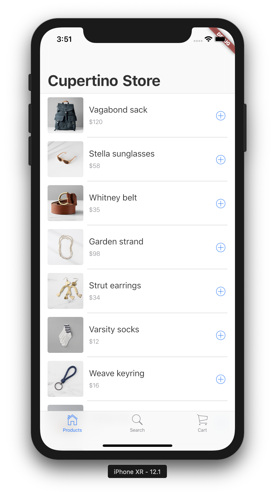
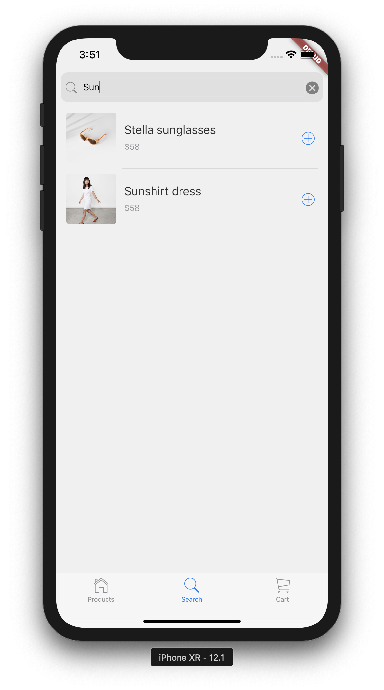
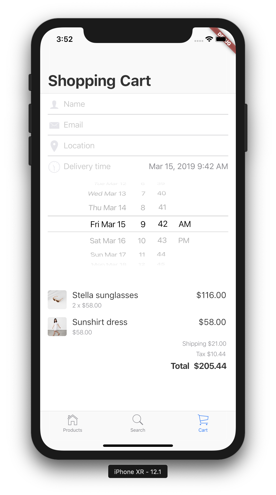

# Flutter Cupertino Store

Ever wanted to create a store app in Flutter that looks totally at home on an 
iOS device? Do we have a deal for you! [Cupertino Widgets][cupertino-widgets]
empower you to build a Flutter app with beautiful and high-fidelity widgets 
for current iOS design language.

## Getting Started

This contains the source code for a codelab working through the steps of 
building a store app.

  - `step-00` contains a Flutter app with a `CupertinoApp` containing
    a titled `CupertinoPageScaffold`. This gives a starting point to add
    structure and content to.
  - `step-01` adds a data source with items for sale, and structure for
    a three tab app using `CupertinoTabScaffold`.
  - `step-02` lists products for sale in the product list tab.
  - `step-03` adds searching products to the search tab.
  - `step-04` starts filling in the final shopping cart tab.
  - `step-05` adds a `CupertinoDatePicker` to the shopping cart tab.
  - `step-06` finishes the shopping cart tab with a list of items in the cart.
  
<table >
 <tr>
  <td></td>
  <td></td>
  <td></td>
 </tr>
</table>

[cupertino-widgets]: https://flutter.dev/docs/development/ui/widgets/cupertino
