# Get to know Firebase for Flutter

[Codelab Feedback](https://github.com/flutter/flutter/issues/new)


## Before you begin
Duration: 01:00

In this codelab, you learn some of the basics of  [Firebase](http://firebase.google.com) to create Flutter mobile apps for Android and iOS.


### Prerequisites

* Familiarity with Flutter
* [The Flutter SDK](https://flutter.dev/get-started/install/)
* [A text editor of your choice](https://flutter.dev/get-started/editor/)

### What you'll learn

* How to to build an event RSVP and guestbook chat app on Android, iOS, the Web, and macOS with Flutter.
* How to authenticate users with Firebase Authentication and sync data with Firestore.

| <p align=center>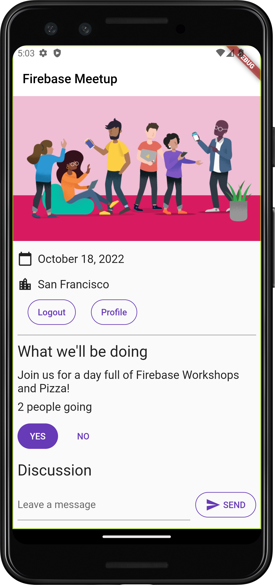</p> | 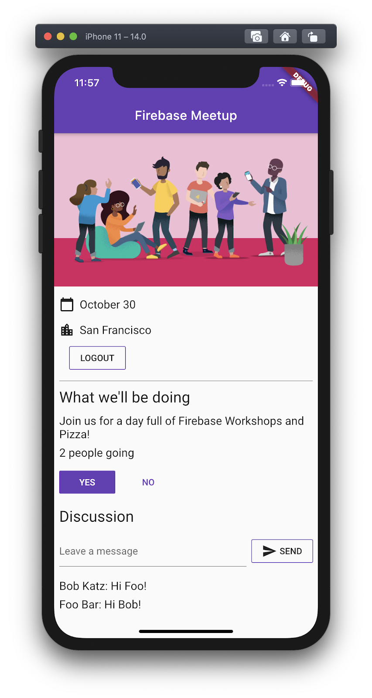 |
| --- | --- |
| 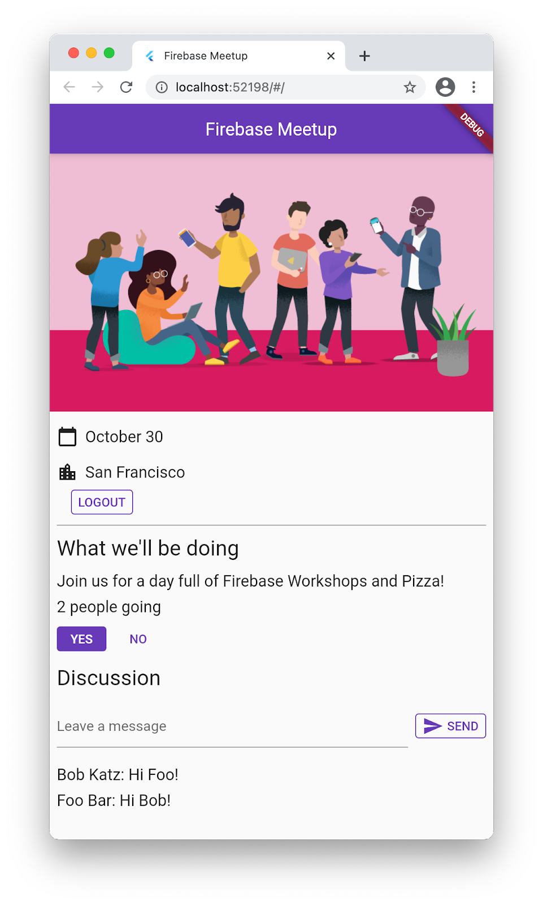 |  |

### What you'll need

Any of the following devices:
* A physical Android or iOS device connected to your computer and set to developer mode.
* The iOS simulator (Requires  [Xcode tools](https://apps.apple.com/us/app/xcode/id497799835)).
* The Android emulator (Requires setup in  [Android Studio](https://developer.android.com/studio/install)).

You also need the following:
* A browser of your choice, such as Google Chrome.
* An IDE or text editor of your choice configured with the Dart and Flutter plugins, such as  [Android Studio](https://developer.android.com/studio) or  [Visual Studio Code](https://code.visualstudio.com/).
* The latest `stable` version of  [Flutter](https://flutter.dev/docs/get-started/web#set-up) or `beta` if you enjoy living on the edge.
* A Google Account for the creation and management of your Firebase project.
* The [`Firebase` CLI](https://firebase.google.com/docs/cli) logged in to your Google Account.


## Get the sample code
Duration: 02:00

Download the initial version of your project from GitHub:
1. From the command line, clone the  [GitHub repository](https://github.com/flutter/codelabs) in the `flutter-codelabs` directory:

```console
git clone https://github.com/flutter/codelabs.git flutter-codelabs
```

The `flutter-codelabs` directory contains the code for a collection of codelabs. The code for this codelab is in the `flutter-codelabs/firebase-get-to-know-flutter` directory. The directory contains a series of snapshots that show how your project should look at the end of each step. For example, you're on the second step.

2. Find the matching files for the second step:

```console
cd flutter-codelabs/firebase-get-to-know-flutter/step_02
```

If you want to skip forward or see how something should look after a step, look in the directory named after the step in which you're interested.

### Import the starter app

* Open or import the `flutter-codelabs/firebase-get-to-know-flutter/step_02` directory in your preferred IDE. This directory contains the starter code for the codelab, which consists of a not-yet-functional Flutter meetup app.

### Locate the files that need work

The code in this app is spread over multiple directories. This split of functionality makes the work easier because it groups the code by functionality.

* Locate the following files:
  * `lib/main.dart`: This file contains the main entry point and the app widget.
  * `lib/home_page.dart`: This file contains the home page widget.
  * `lib/src/widgets.dart`: This file contains a handful of widgets to help standardize the style of the app. They compose the screen of the starter app.
  * `lib/src/authentication.dart`: This file contains a partial implementation of  [Authentication](https://firebase.google.com/docs/auth) with a set of widgets to create a login user experience for Firebase email-based authentication. These widgets for the auth flow aren't yet used in the starter app, but you add them soon.

You add additional files as required to build the rest of the app.

### Review the `lib/main.dart` file

This app takes advantage of the  [`google_fonts`](https://pub.dev/packages/google_fonts) package to make Roboto the default font throughout the app. You can explore  [fonts.google.com](https://fonts.google.com/) and use the fonts that you discover there in different parts of the app.

You use the helper widgets from the `lib/src/widgets.dart` file in the form of `Header`, `Paragraph` and `IconAndDetail`. These widgets eliminate duplicated code to reduce clutter in the page layout described in `HomePage`. This also enables a consistent look and feel.

Here's what your app looks like on Android, iOS, the Web, and macOS:

| <p align=center>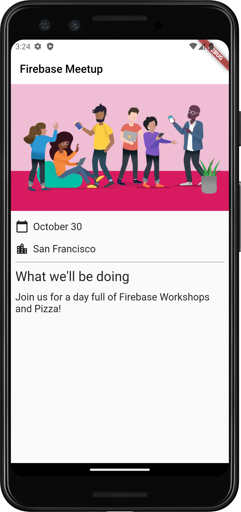</p> | 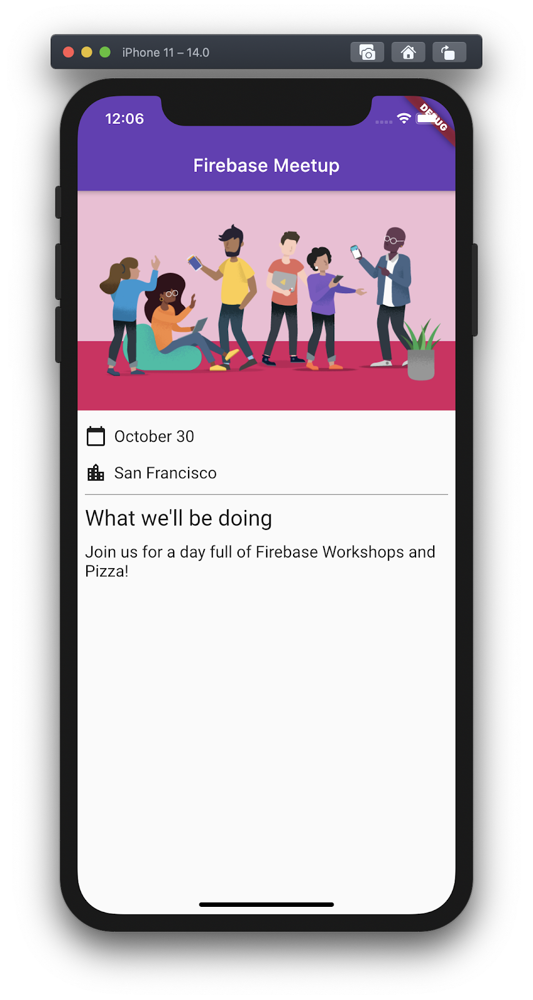 |
| --- | --- |
| 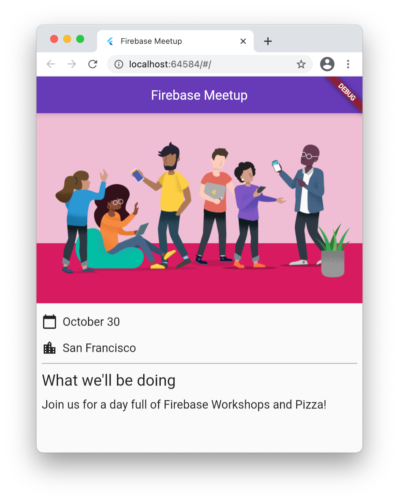 | 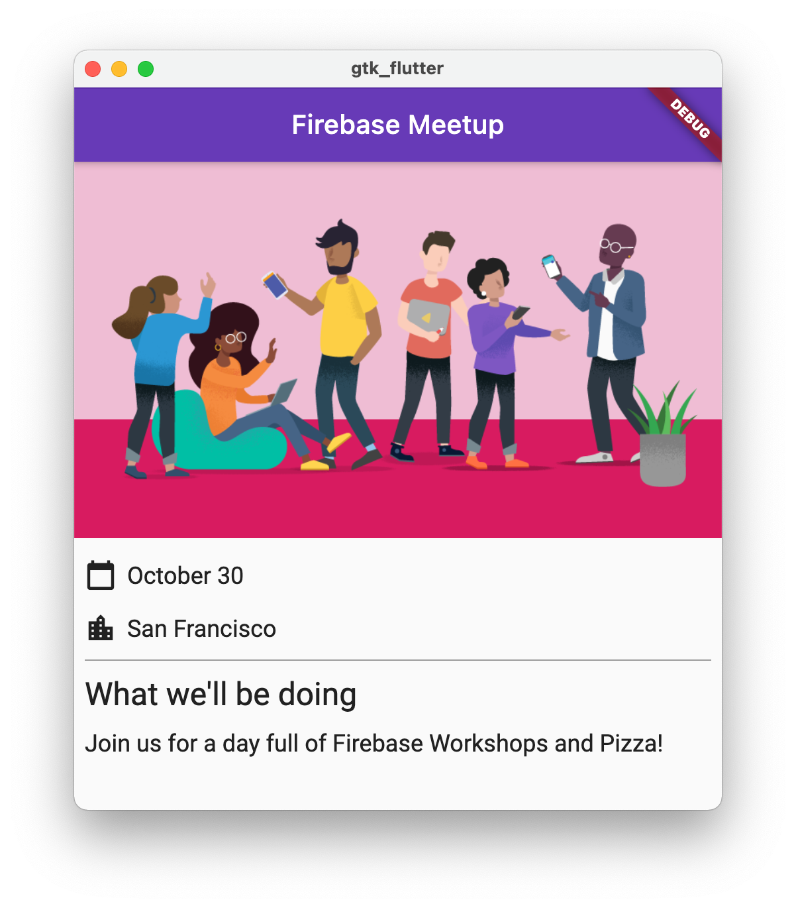 |


## Create and configure a Firebase project
Duration: 07:00

The display of event information is great for your guests, but it isn't very useful for anybody on its own. You need to add some dynamic functionality to the app. To do so, you need to connect Firebase to your app. To get started with Firebase, you need to create and configure a Firebase project.


### Create a Firebase project

1. Sign in to  [Firebase](https://console.firebase.google.com/).
2. In the console, click **Add Project** or **Create a project**.
3. In the **Project name** field, enter **Firebase-Flutter-Codelab** and then click **Continue**.

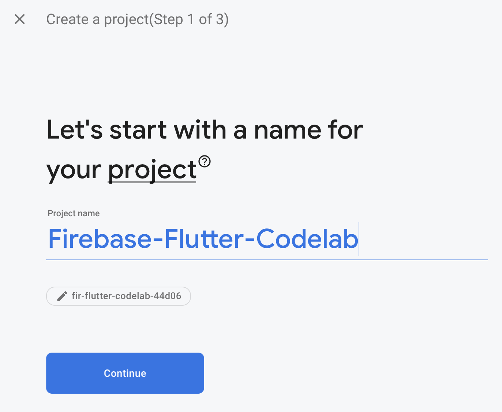

4. Click through the project creation options. If prompted, accept the Firebase terms, but skip setup of Google Analytics because you won't be use it for this app.

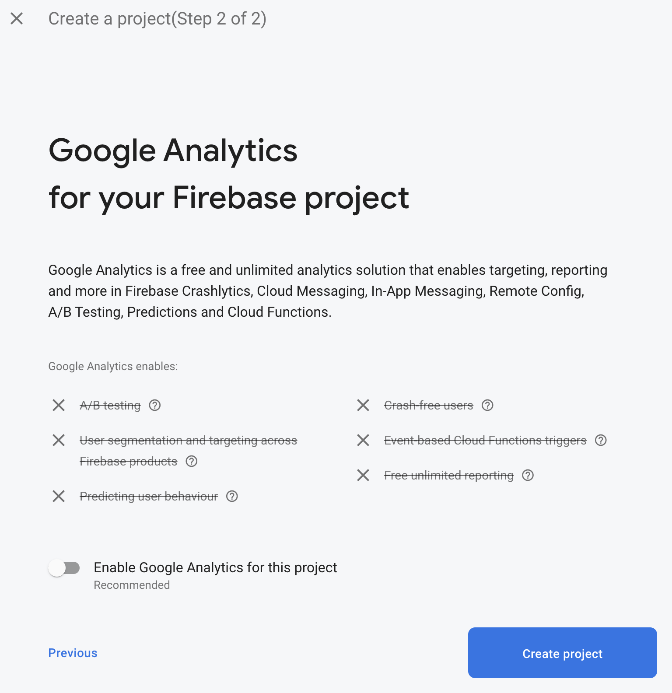

To learn more about Firebase projects, see  [Understand Firebase projects](https://www.google.com/url?q=https://firebase.google.com/docs/projects/learn-more&sa=D&ust=1568059744191000&usg=AFQjCNEo043D9nD4a1aS2AjK8ReenvZ3Pg).

The app uses the following Firebase products, which are available for web apps:
* **Authentication:** Lets users sign in to your app.
* **Firestore:** Saves structured data on the cloud and gets instant notifications when data changes.
* **Firebase Security Rules:** Secures your database.

Some of these products need special configuration or you need to enable them in the Firebase console.

### Enable email sign-in authentication

1. In the Firebase console's **Project overview** pane, expand the **Build** menu.
2. Click **Authentication > Get Started > Sign-in method > Email/Password > Enable > Save**.

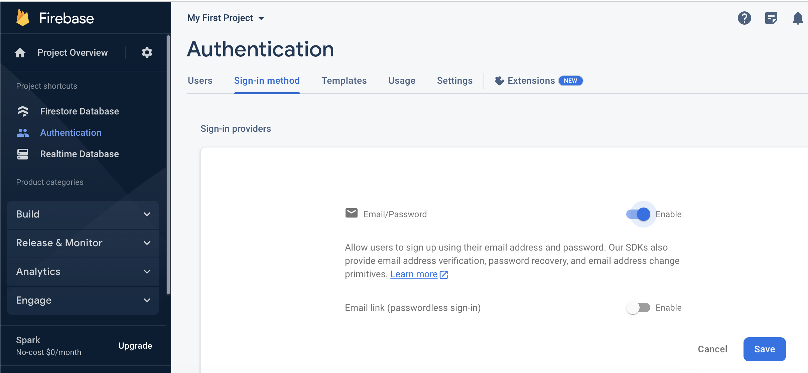

### Enable Firestore

The web app uses  [Firestore](https://firebase.google.com/docs/firestore/) to save chat messages and receive new chat messages.

Enable Firestore:
* In the **Build** menu, click **Cloud Firestore > Create database**.

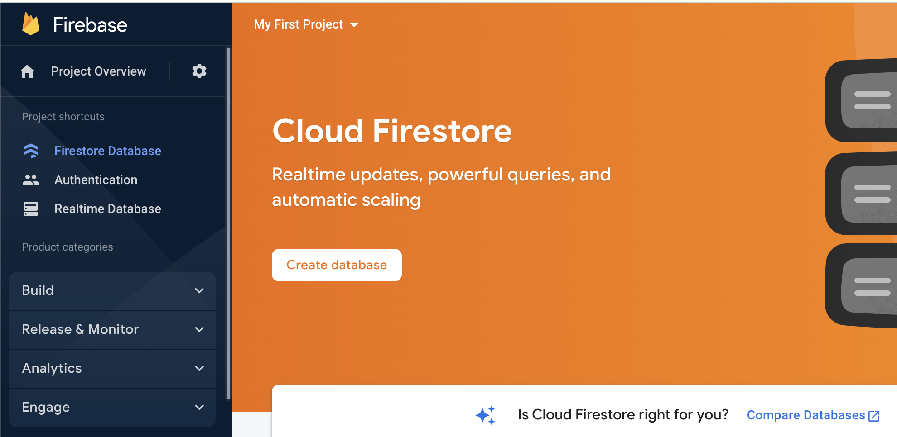

> aside negative
>
> **Caution:** Ensure that you enable Firestore and *not* the Firebase Realtime Database for this codelab. To learn the difference between the two, see  [Choose a Database: Firestore or Realtime Database](https://firebase.google.com/docs/database/rtdb-vs-firestore).

3. Select **Start in test mode** and then read the disclaimer about the security rules. Test mode ensures that you can freely write to the database during development.

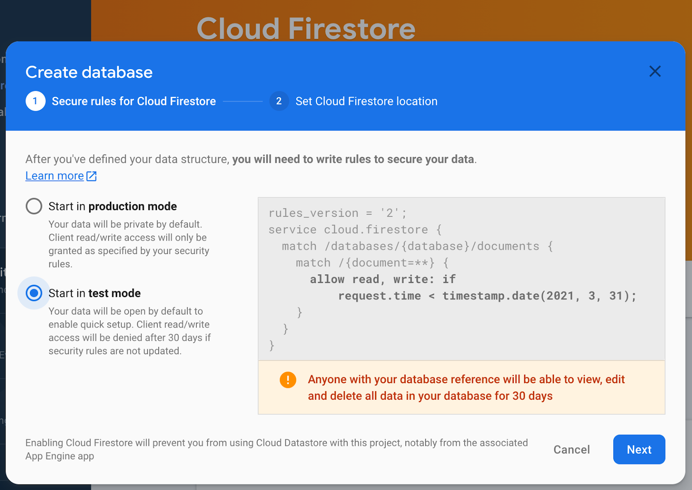

> aside negative
>
> **Caution:** In the first stages of this codelab, you use test mode. Later in the codelab, you write Firebase Security Rules to secure your database.
>
> For your apps, especially production apps, it's important that you secure your database with security rules. To learn more about security rules, see [Firebase Security Rules](https://firebase.google.com/docs/rules).

4. Click **Next** and then select the location for your database. You can use the default. You can't change the location later.

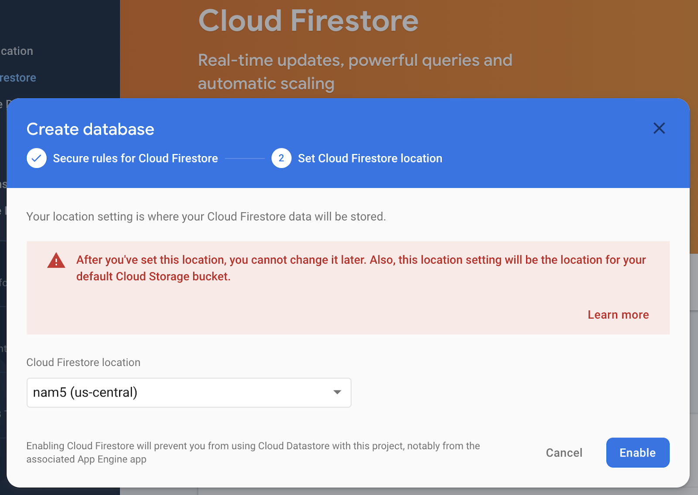

5. Click **Enable**.


## Configure Firebase
Duration: 08:00

> aside positive
>
> **Note:** If you only intend to use iOS or Android, you only need one of the following configurations. This step includes instructions for both for completeness sake.

To use Firebase with Flutter, you need to complete the following tasks to configure the Flutter project to use the `FlutterFire` libraries correctly:
1. Add the `FlutterFire` dependencies to your project.
2. Register the desired platform on the Firebase project.
3. Download the platform-specific configuration file and then add it to the code.


> aside negative
>
> **Caution**: You need to register all the platforms that you want to use in the same Firebase project.

In the top-level directory of your Flutter app, there are `android`, `ios`, `macos` and `web` subdirectories, which hold the platform-specific configuration files for iOS and Android, respectively.

### Configure dependencies

You need to add the `FlutterFire` libraries for the two Firebase products that you use in this app: Authentication and Firestore.

* From the command line, add the following depencies:

```console
$ flutter pub add firebase_core
```

The [`firebase_core` package](https://pub.dev/packages/firebase_core) is the common code required for all Firebase Flutter plugins.

```console
$ flutter pub add firebase_auth
```

The [`firebase_auth` package](https://pub.dev/packages/firebase_auth) enables integration with Authentication.

```console
$ flutter pub add cloud_firestore
```

The [`cloud_firestore` package](https://pub.dev/packages/cloud_firestore) enables access to Firestore data storage.

```console
$ flutter pub add provider
```

The [`firebase_ui_auth` package](https://pub.dev/packages/firebase_ui_auth) provides a set of widgets and utilities to increase developer velocity with authentication flows.

```console
$ flutter pub add firebase_ui_auth
```

You added the required packages, but you also need to configure the iOS, Android, macOS, and Web runner projects to appropriately use Firebase. You also use the [`provider` package](https://pub.dev/packages/provider) that enables separation of business logic from display logic.

### Install the FlutterFire CLI

The FlutterFire CLI depends on the underlying Firebase CLI.

1. If you haven't done so already, install the [Firebase CLI](https://firebase.google.com/docs/cli) on your machine.

2. Install the FlutterFire CLI:

```console
$ dart pub global activate flutterfire_cli
```

Once installed, the `flutterfire` command is globally available.

### Configure your apps

The CLI extracts information from your Firebase project and selected project apps to generate all the configuration for a specific platform.

In the root of your app, run the `configure` command:

```console
$ flutterfire configure
```

The configuration command guides you through the following processes:
1. Select a Firebase project based on the `.firebaserc` file or from the Firebase Console.
1. Determine platforms for configuration, such as Android, iOS, macOS, and web.
1. Identify the Firebase apps from which to extract configuration. By default, the CLI attempts to automatically match Firebase apps based on your current project configuration.
1. Generate a `firebase_options.dart` file in your project.

### Configure macOS

Flutter on macOS builds fully sandboxed apps. As this app integrates with the network to communicate with the Firebase servers, you need to configure your app with network client privileges.

####  [macos/Runner/DebugProfile.entitlements](https://github.com/flutter/codelabs/blob/master/firebase-get-to-know-flutter/step_04/macos/Runner/DebugProfile.entitlements)
```xml
<?xml version="1.0" encoding="UTF-8"?>
<!DOCTYPE plist PUBLIC "-//Apple//DTD PLIST 1.0//EN" "http://www.apple.com/DTDs/PropertyList-1.0.dtd">
<plist version="1.0">
<dict>
	<key>com.apple.security.app-sandbox</key>
	<true/>
	<key>com.apple.security.cs.allow-jit</key>
	<true/>
	<key>com.apple.security.network.server</key>
	<true/>
  <!-- Add the following two lines -->
	<key>com.apple.security.network.client</key>
	<true/>
</dict>
</plist>
```

####  [macos/Runner/Release.entitlements](https://github.com/flutter/codelabs/blob/master/firebase-get-to-know-flutter/step_04/macos/Runner/Release.entitlements)
```xml
<?xml version="1.0" encoding="UTF-8"?>
<!DOCTYPE plist PUBLIC "-//Apple//DTD PLIST 1.0//EN" "http://www.apple.com/DTDs/PropertyList-1.0.dtd">
<plist version="1.0">
<dict>
	<key>com.apple.security.app-sandbox</key>
	<true/>
  <!-- Add the following two lines -->
	<key>com.apple.security.network.client</key>
	<true/>
</dict>
</plist>
```

For more information, see [Desktop support for Flutter](https://docs.flutter.dev/development/platform-integration/desktop).

## Add RSVP functionality
Duration: 10:00

Now that you added Firebase to the app, you can create an **RSVP** button that registers people with  [Authentication](https://firebase.google.com/docs/auth). For Android native, iOS native, and Web, there are prebuilt `FirebaseUI Auth` packages, but you need to build this capability for Flutter.

The project that you retrieved earlier included a set of widgets that implements the user interface for most of the authentication flow. You implement the business logic to integrate Authentication with the app.

### Add business logic with the `Provider` package

Use the  [`provider` package](https://pub.dev/packages/provider) to make a centralized app state object available throughout the app's tree of Flutter widgets:

1. Create a new file named `app_state.dart` with the following content:

####  [lib/app_state.dart](https://github.com/flutter/codelabs/blob/master/firebase-get-to-know-flutter/step_05/lib/app_state.dart#L1)

```dart
import 'package:firebase_auth/firebase_auth.dart'
    hide EmailAuthProvider, PhoneAuthProvider;
import 'package:firebase_core/firebase_core.dart';
import 'package:firebase_ui_auth/firebase_ui_auth.dart';
import 'package:flutter/material.dart';

import 'firebase_options.dart';

class ApplicationState extends ChangeNotifier {
  ApplicationState() {
    init();
  }

  bool _loggedIn = false;
  bool get loggedIn => _loggedIn;

  Future<void> init() async {
    await Firebase.initializeApp(
        options: DefaultFirebaseOptions.currentPlatform);

    FirebaseUIAuth.configureProviders([
      EmailAuthProvider(),
    ]);

    FirebaseAuth.instance.userChanges().listen((user) {
      if (user != null) {
        _loggedIn = true;
      } else {
        _loggedIn = false;
      }
      notifyListeners();
    });
  }
}
```

The `import` statements introduce Firebase Core and Auth, pull in the `provider` package that makes app state object available throughout the widget tree, and include the authentication widgets from the `firebase_ui_auth` package.

This `ApplicationState` application state object has one main responsibility for this step, which is to alert the widget tree that there was an update to an authenticated state.

You only use a provider to communicate the state of a user's login status to the app. To let a user log in, you use the UIs provided by the `firebase_ui_auth` package, which is a great way to quickly bootstrap login screens in your apps.

### Integrate the authentication flow

1. Modify the imports at the top of the `lib/main.dart` file:

####  [lib/main.dart](https://github.com/flutter/codelabs/blob/master/firebase-get-to-know-flutter/step_05/lib/main.dart#L1)

```dart
import 'package:firebase_ui_auth/firebase_ui_auth.dart'; // new
import 'package:flutter/material.dart';
import 'package:go_router/go_router.dart';               // new
import 'package:google_fonts/google_fonts.dart';
import 'package:provider/provider.dart';                 // new

import 'app_state.dart';                                 // new
import 'home_page.dart';
```

2. Connect the app state with the app initialization and then add the authentication flow to `HomePage`:

####  [lib/main.dart](https://github.com/flutter/codelabs/blob/master/firebase-get-to-know-flutter/step_05/lib/main.dart#L14)

```dart
void main() {
  // Modify from here...
  WidgetsFlutterBinding.ensureInitialized();

  runApp(ChangeNotifierProvider(
    create: (context) => ApplicationState(),
    builder: ((context, child) => const App()),
  ));
  // ...to here.
}
```

The modification to the `main()` function makes the provider package responsible for the instantiation of the app state object with the `ChangeNotifierProvider` widget. You use this specific `provider` class because the app state object extends the `ChangeNotifier` class, which lets the `provider` package know when to redisplay dependent widgets.

3. Update your app to handle navigation to different screens that FirebaseUI provides for you, by creating a `GoRouter` configuration:

####  [lib/main.dart](https://github.com/flutter/codelabs/blob/master/firebase-get-to-know-flutter/step_05/lib/main.dart#L23)

```dart
// Add GoRouter configuration outside the App class
final _router = GoRouter(
  routes: [
    GoRoute(
      path: '/',
      builder: (context, state) => const HomePage(),
      routes: [
        GoRoute(
          path: 'sign-in',
          builder: (context, state) {
            return SignInScreen(
              actions: [
                ForgotPasswordAction(((context, email) {
                  final uri = Uri(
                    path: '/sign-in/forgot-password',
                    queryParameters: <String, String?>{
                      'email': email,
                    },
                  );
                  context.push(uri.toString());
                })),
                AuthStateChangeAction(((context, state) {
                  if (state is SignedIn || state is UserCreated) {
                    var user = (state is SignedIn)
                        ? state.user
                        : (state as UserCreated).credential.user;
                    if (user == null) {
                      return;
                    }
                    if (state is UserCreated) {
                      user.updateDisplayName(user.email!.split('@')[0]);
                    }
                    if (!user.emailVerified) {
                      user.sendEmailVerification();
                      const snackBar = SnackBar(
                          content: Text(
                              'Please check your email to verify your email address'));
                      ScaffoldMessenger.of(context).showSnackBar(snackBar);
                    }
                    context.pushReplacement('/');
                  }
                })),
              ],
            );
          },
          routes: [
            GoRoute(
              path: 'forgot-password',
              builder: (context, state) {
                final arguments = state.queryParams;
                return ForgotPasswordScreen(
                  email: arguments['email'],
                  headerMaxExtent: 200,
                );
              },
            ),
          ],
        ),
        GoRoute(
          path: 'profile',
          builder: (context, state) {
            return ProfileScreen(
              providers: const [],
              actions: [
                SignedOutAction((context) {
                  context.pushReplacement('/');
                }),
              ],
            );
          },
        ),
      ],
    ),
  ],
);
// end of GoRouter configuration

// Change MaterialApp to MaterialApp.router and add the routerConfig
class App extends StatelessWidget {
  const App({super.key});

  @override
  Widget build(BuildContext context) {
    return MaterialApp.router(
      title: 'Firebase Meetup',
      theme: ThemeData(
        buttonTheme: Theme.of(context).buttonTheme.copyWith(
              highlightColor: Colors.deepPurple,
            ),
        primarySwatch: Colors.deepPurple,
        textTheme: GoogleFonts.robotoTextTheme(
          Theme.of(context).textTheme,
        ),
        visualDensity: VisualDensity.adaptivePlatformDensity,
        useMaterial3: true,
      ),
      routerConfig: _router, // new
    );
  }
}
```

Each screen has a different type of action associated with it based on the new state of the authentication flow. After most state changes in authentication, you can reroute back to a preferred screen, whether it's the home screen or a different screen, such as profile.

4. In the `HomePage` class's build method, integrate the app state with the `AuthFunc` widget:

####  [lib/home_page.dart](https://github.com/flutter/codelabs/blob/master/firebase-get-to-know-flutter/step_05/lib/home_page.dart#L14)

```dart
import 'package:firebase_auth/firebase_auth.dart' // new
    hide EmailAuthProvider, PhoneAuthProvider;    // new
import 'package:flutter/material.dart';           // new
import 'package:provider/provider.dart';          // new

import 'app_state.dart';                          // new
import 'src/authentication.dart';                 // new
import 'src/widgets.dart';

class HomePage extends StatelessWidget {
  const HomePage({super.key});

  @override
  Widget build(BuildContext context) {
    return Scaffold(
      appBar: AppBar(
        title: const Text('Firebase Meetup'),
      ),
      body: ListView(
        children: <Widget>[
          Image.asset('assets/codelab.png'),
          const SizedBox(height: 8),
          const IconAndDetail(Icons.calendar_today, 'October 30'),
          const IconAndDetail(Icons.location_city, 'San Francisco'),
          // Add from here
          Consumer<ApplicationState>(
            builder: (context, appState, _) => AuthFunc(
                loggedIn: appState.loggedIn,
                signOut: () {
                  FirebaseAuth.instance.signOut();
                }),
          ),
          // to here
          const Divider(
            height: 8,
            thickness: 1,
            indent: 8,
            endIndent: 8,
            color: Colors.grey,
          ),
          const Header("What we'll be doing"),
          const Paragraph(
            'Join us for a day full of Firebase Workshops and Pizza!',
          ),
        ],
      ),
    );
  }
}
```

You instantiate the `AuthFunc` widget and wrap it in a `Consumer` widget. The Consumer widget is the usual way that the `provider` package can be used to rebuild part of the tree when the app state changes. The `AuthFunc` widget is the supplementary widgets that you test.

#### Test the authentication flow

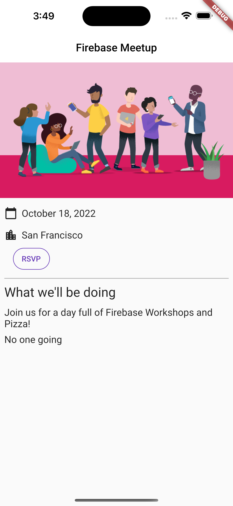

1. In the app, tap the **RSVP** button to initiate the `SignInScreen`.

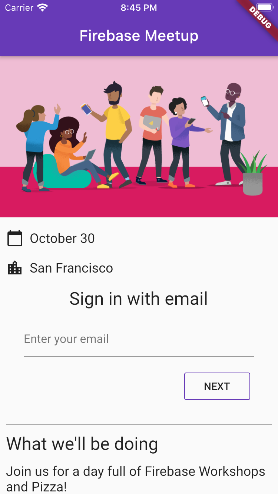

2. Enter an email address. If you're already registered, the system prompts you to enter a password. Otherwise, the system prompts you to complete the registration form.

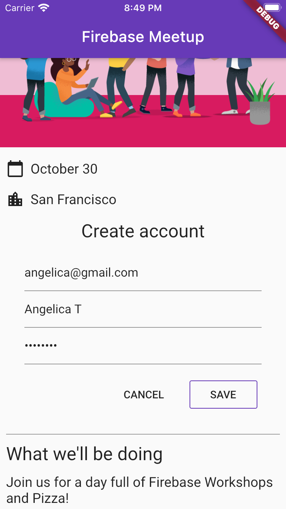

3. Enter a password that's less than six characters to check the error-handling flow. If you're registered, you see the password for instead.

4. Enter incorrect passwords to check the error-handling flow.

5. Enter the correct password. You see the logged-in experience, which offers the user the ability to log out.

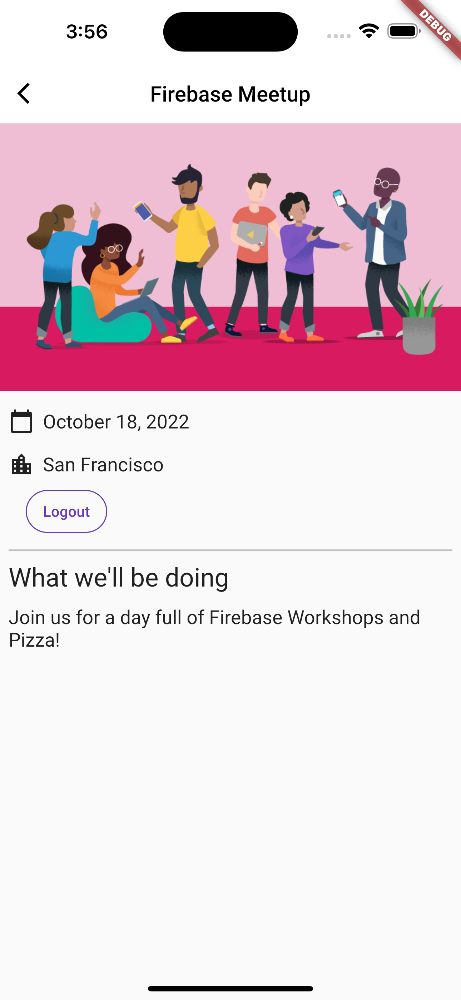

## Write messages to Firestore
Duration: 10:00


It's great to know that users are coming, but you need to give the guests something else to do in the app. What if they could leave messages in a guestbook? They can share why they're excited to come or who they hope to meet.


To store the chat messages that users write in the app, you use  [Firestore](https://firebase.google.com/docs/firestore/).

### Data model

Firestore is a NoSQL database, and data stored in the database is split into collections, documents, fields, and subcollections. You store each message of the chat as a document in a `gustbook ` collection, which is a top-level collection.

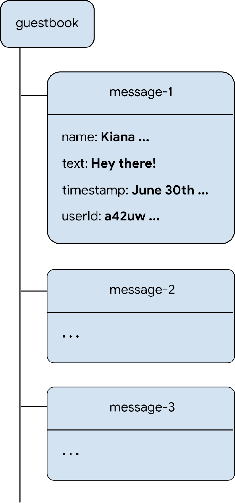

> aside positive
>
> **Note**: To learn more about the Firestore data model, see  [Firestore Data model](https://firebase.google.com/docs/firestore/data-model)and  [this great series of videos](https://www.youtube.com/playlist?list=PLl-K7zZEsYLluG5MCVEzXAQ7ACZBCuZgZ).

### Add messages to Firestore

In this section, you add the functionality for users to write messages to the database. First, you add a form field and send button, and then you add the code that connects these elements with the database.

1. Create a new file named `guest_book.dart`, add a `GuestBook` stateful widget to construct the UI elements of a message field and a send button:

####  [lib/guest_book.dart](https://github.com/flutter/codelabs/blob/master/firebase-get-to-know-flutter/step_06/lib/guest_book.dart)

```dart
import 'dart:async';

import 'package:flutter/material.dart';

import 'src/widgets.dart';

class GuestBook extends StatefulWidget {
  const GuestBook({required this.addMessage, super.key});

  final FutureOr<void> Function(String message) addMessage;

  @override
  State<GuestBook> createState() => _GuestBookState();
}

class _GuestBookState extends State<GuestBook> {
  final _formKey = GlobalKey<FormState>(debugLabel: '_GuestBookState');
  final _controller = TextEditingController();

  @override
  Widget build(BuildContext context) {
    return Padding(
      padding: const EdgeInsets.all(8.0),
      child: Form(
        key: _formKey,
        child: Row(
          children: [
            Expanded(
              child: TextFormField(
                controller: _controller,
                decoration: const InputDecoration(
                  hintText: 'Leave a message',
                ),
                validator: (value) {
                  if (value == null || value.isEmpty) {
                    return 'Enter your message to continue';
                  }
                  return null;
                },
              ),
            ),
            const SizedBox(width: 8),
            StyledButton(
              onPressed: () async {
                if (_formKey.currentState!.validate()) {
                  await widget.addMessage(_controller.text);
                  _controller.clear();
                }
              },
              child: Row(
                children: const [
                  Icon(Icons.send),
                  SizedBox(width: 4),
                  Text('SEND'),
                ],
              ),
            ),
          ],
        ),
      ),
    );
  }
}
```

There are a couple of points of interest here. First, you instantiate a form so that you can validate that the message actually contains content and show the user an error message if there isn't any. To validate a form, you access the form state behind the form with a `GlobalKey`. For more information about Keys and how to use them, see  [When to Use Keys](https://www.youtube.com/watch?v=kn0EOS-ZiIc).

Also note the way that the widgets are laid out, you have a `Row` with a `TextFormField` and a `StyledButton`, which contains a `Row`. Also note the `TextFormField` is wrapped in an `Expanded` widget, which forces the `TextFormField` to fill any extra space in the row. To better understand why this is required, see  [Understanding constraints](https://flutter.dev/docs/development/ui/layout/constraints).

Now that you have a widget that enables the user to enter some text to add to the Guest Book, you need to get it on the screen.

2. Edit the body of `HomePage` to add the following two lines at the end of the `ListView`'s children:

```dart
const Header("What we'll be doing"),
const Paragraph(
  'Join us for a day full of Firebase Workshops and Pizza!',
),
// Add the following two lines.
const Header('Discussion'),
GuestBook(addMessage: (message) => print(message)),
```

While this is enough to display the widget, it isn't sufficient to do anything useful. You update this code shortly to make it functional.

#### App preview

| <p align=center>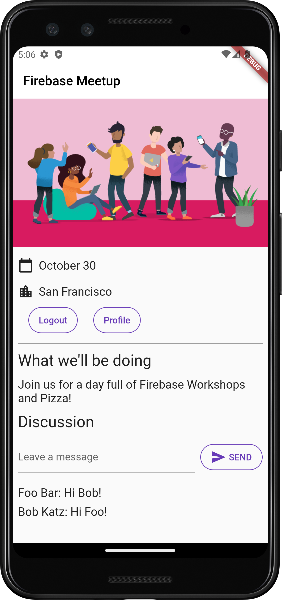</p> | 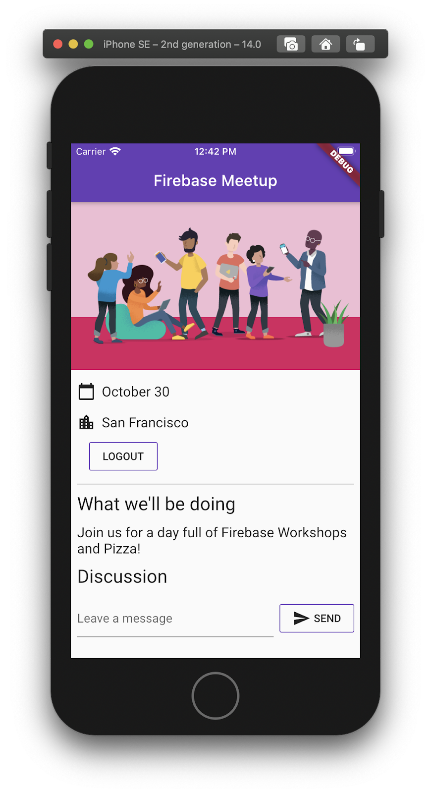 |
| --- | --- |
| 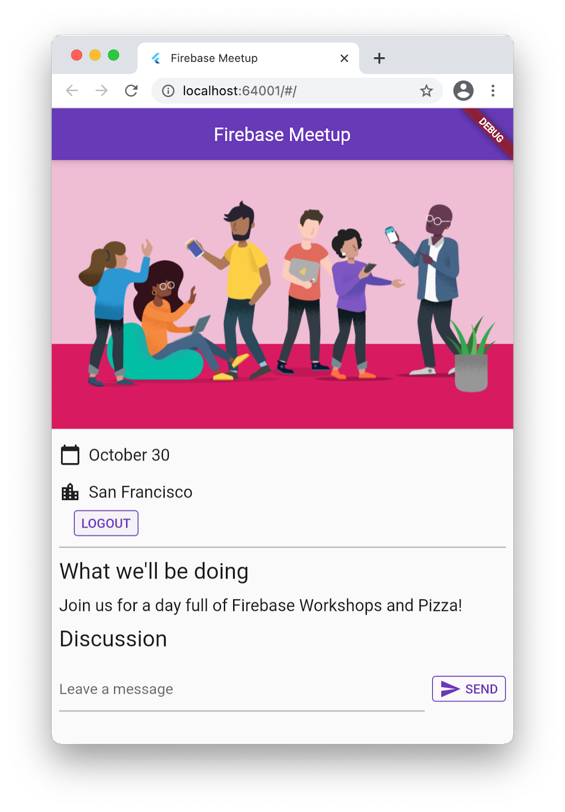 | 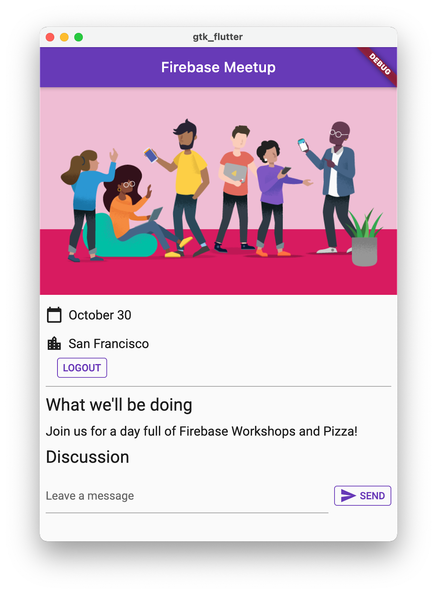 |

When a user clicks **SEND**, it triggers the following code snippet. It adds the contents of the message input field to the `guestbook` collection of the database. Specifically, the `addMessageToGuestBook` method adds the message content to a new document with an automatically generated ID in the `guestbook` collection.

Note that `FirebaseAuth.instance.currentUser.uid` is a reference to the autogenerated unique ID that Authentication gives for all logged-in users.

* In the `lib/app_state.dart` file, add the `addMessageToGuestBook` method. You connect this capability with the user interface in the next step.

####  [lib/app_state.dart](https://github.com/flutter/codelabs/blob/master/firebase-get-to-know-flutter/step_06/lib/app_state.dart#L41)

```dart
import 'package:cloud_firestore/cloud_firestore.dart'; // new
import 'package:firebase_auth/firebase_auth.dart'
    hide EmailAuthProvider, PhoneAuthProvider;
import 'package:firebase_core/firebase_core.dart';
import 'package:firebase_ui_auth/firebase_ui_auth.dart';
import 'package:flutter/material.dart';

import 'firebase_options.dart';

class ApplicationState extends ChangeNotifier {

  // Current content of ApplicationState elided ...

  // Add from here...
  Future<DocumentReference> addMessageToGuestBook(String message) {
    if (!_loggedIn) {
      throw Exception('Must be logged in');
    }

    return FirebaseFirestore.instance
        .collection('guestbook')
        .add(<String, dynamic>{
      'text': message,
      'timestamp': DateTime.now().millisecondsSinceEpoch,
      'name': FirebaseAuth.instance.currentUser!.displayName,
      'userId': FirebaseAuth.instance.currentUser!.uid,
    });
  }
  // ...to here.
}
```

### Connect UI and database

You have a UI where the user can enter the text they want to add to the Guest Book and you have the code to add the entry to Firestore. Now all you need to do is connect the two.

* In the `lib/home_page.dart` file, make the following change to the `HomePage` widget:

####  [lib/home_page.dart](https://github.com/flutter/codelabs/blob/master/firebase-get-to-know-flutter/step_06/lib/home_page.dart#L15)

```dart
import 'package:firebase_auth/firebase_auth.dart'
    hide EmailAuthProvider, PhoneAuthProvider;
import 'package:flutter/material.dart';
import 'package:provider/provider.dart';

import 'app_state.dart';
import 'guest_book.dart';                         // new
import 'src/authentication.dart';
import 'src/widgets.dart';

class HomePage extends StatelessWidget {
  const HomePage({Key? key}) : super(key: key);

  @override
  Widget build(BuildContext context) {
    return Scaffold(
      appBar: AppBar(
        title: const Text('Firebase Meetup'),
      ),
      body: ListView(
        children: <Widget>[
          Image.asset('assets/codelab.png'),
          const SizedBox(height: 8),
          const IconAndDetail(Icons.calendar_today, 'October 30'),
          const IconAndDetail(Icons.location_city, 'San Francisco'),
          Consumer<ApplicationState>(
            builder: (context, appState, _) => AuthFunc(
                loggedIn: appState.loggedIn,
                signOut: () {
                  FirebaseAuth.instance.signOut();
                }),
          ),
          const Divider(
            height: 8,
            thickness: 1,
            indent: 8,
            endIndent: 8,
            color: Colors.grey,
          ),
          const Header("What we'll be doing"),
          const Paragraph(
            'Join us for a day full of Firebase Workshops and Pizza!',
          ),
          // Modify from here...
          Consumer<ApplicationState>(
            builder: (context, appState, _) => Column(
              crossAxisAlignment: CrossAxisAlignment.start,
              children: [
                if (appState.loggedIn) ...[
                  const Header('Discussion'),
                  GuestBook(
                    addMessage: (message) =>
                        appState.addMessageToGuestBook(message),
                  ),
                ],
              ],
            ),
          ),
          // ...to here.
        ],
      ),
    );
  }
}
```

You replaced the two lines that you added at the start of this step with the full implementation. You again use `Consumer&lt;ApplicationState&gt;` to make the app state available to the part of the tree that you render. This lets you react to someone who enters a message in the UI and publish it in the database. In the next section, you test whether the added messages are published in the database.

### Test sending messages

1. If necessary, sign in to the app.
2. Enter a message, such as `Hey there!`, and then click **SEND**.

This action writes the message to your Firestore database. However, you don't see the message in your actual Flutter app because you still need to implement retrieval of the data, which you do in the next step. However, in the Firebase console's [**Database** dashboard](https://console.firebase.google.com/project/_/database), you can see your added message in the `guestbook` collection. If you send more messages, you add more documents to your `guestbook` collection. For example, see the following code snippet:

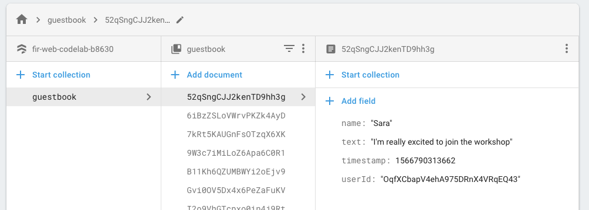


## Read messages
Duration: 10:00

It's lovely that guests can write messages to the database, but they can't see them in the app yet. Time to fix that!


### Synchronize messages

To display messages, you need to add listeners that trigger when data changes and then create a UI element that shows new messages. You add code to the app state that listens for newly added messages from the app.

1. Create a new file `guest_book_message.dart`, add the following class to expose a structured view of the data that you store in Firestore.

####  [lib/guest_book_message.dart](https://github.com/flutter/codelabs/blob/master/firebase-get-to-know-flutter/step_07/lib/guest_book_message.dart)

```dart
class GuestBookMessage {
  GuestBookMessage({required this.name, required this.message});

  final String name;
  final String message;
}
```

2. In the `lib/app_state.dart` file, add the following imports:

####  [lib/app_state.dart](https://github.com/flutter/codelabs/blob/master/firebase-get-to-know-flutter/step_07/lib/app_staet.dart#L1)

```dart
import 'dart:async';                                     // new

import 'package:cloud_firestore/cloud_firestore.dart';
import 'package:firebase_auth/firebase_auth.dart'
    hide EmailAuthProvider, PhoneAuthProvider;
import 'package:firebase_core/firebase_core.dart';
import 'package:firebase_ui_auth/firebase_ui_auth.dart';
import 'package:flutter/material.dart';

import 'firebase_options.dart';
import 'guest_book_message.dart';                        // new
```

3. In section of `ApplicationState` where you define state and getters, add the following lines:

####  [lib/app_state.dart](https://github.com/flutter/codelabs/blob/master/firebase-get-to-know-flutter/step_07/lib/app_staet.dart#L22)

```dart
  bool _loggedIn = false;
  bool get loggedIn => _loggedIn;

  // Add from here...
  StreamSubscription<QuerySnapshot>? _guestBookSubscription;
  List<GuestBookMessage> _guestBookMessages = [];
  List<GuestBookMessage> get guestBookMessages => _guestBookMessages;
  // ...to here.
```

4. In the initialization section of `ApplicationState`, add the following lines to subscribe to a query over the document collection when a user logs in and unsubscribe when they log out:

####  [lib/app_state.dart](https://github.com/flutter/codelabs/blob/master/firebase-get-to-know-flutter/step_07/lib/app_state.dart#L29)

```dart
  Future<void> init() async {
    await Firebase.initializeApp(
        options: DefaultFirebaseOptions.currentPlatform);

    FirebaseUIAuth.configureProviders([
      EmailAuthProvider(),
    ]);
    
    FirebaseAuth.instance.userChanges().listen((user) {
      if (user != null) {
        _loggedIn = true;
        _guestBookSubscription = FirebaseFirestore.instance
            .collection('guestbook')
            .orderBy('timestamp', descending: true)
            .snapshots()
            .listen((snapshot) {
          _guestBookMessages = [];
          for (final document in snapshot.docs) {
            _guestBookMessages.add(
              GuestBookMessage(
                name: document.data()['name'] as String,
                message: document.data()['text'] as String,
              ),
            );
          }
          notifyListeners();
        });
      } else {
        _loggedIn = false;
        _guestBookMessages = [];
        _guestBookSubscription?.cancel();
      }
      notifyListeners();
    });
  }
```

This section is important because it's where you construct a query over the `guestbook` collection, and handle subscribing and unsubscribing to this collection. You listen to the stream, where you reconstruct a local cache of the messages in the `guestbook` collection and also store a reference to this subscription so that you can unsubscribe from it later. There's a lot going on here, so you should explore it in a debugger to inspect what happens to get a clearer mental model. For more information, see  [Get realtime updates with Firestore](https://firebase.google.com/docs/firestore/query-data/listen).

> aside positive
>
> **Note**: For a faster refresh, you can update only the changed documents instead of the whole list. To learn more, see  [View changes between snapshots](https://firebase.google.com/docs/firestore/query-data/listen#view_changes_between_snapshots).

5. In the `lib/guest_book.dart` file, add the following import:

```dart
import 'guest_book_message.dart';
```

6. In the `GuestBook` widget, add a list of messages as part of the configuration to connect this changing state to the user interface:

####  [lib/guest_book.dart](https://github.com/flutter/codelabs/blob/master/firebase-get-to-know-flutter/step_07/lib/guest_book.dart#L12)

```dart
class GuestBook extends StatefulWidget {
  // Modify the following line:
  const GuestBook({
    super.key, 
    required this.addMessage, 
    required this.messages,
  });

  final FutureOr<void> Function(String message) addMessage;
  final List<GuestBookMessage> messages; // new

  @override
  _GuestBookState createState() => _GuestBookState();
}
```

7. In `_GuestBookState`, modify the `build` method as follows to expose this configuration:

####  [lib/guest_book.dart](https://github.com/flutter/codelabs/blob/master/firebase-get-to-know-flutter/step_07/lib/guest_book.dart#L26)

```dart
class _GuestBookState extends State<GuestBook> {
  final _formKey = GlobalKey<FormState>(debugLabel: '_GuestBookState');
  final _controller = TextEditingController();

  @override
  // Modify from here...
  Widget build(BuildContext context) {
    return Column(
      crossAxisAlignment: CrossAxisAlignment.start,
      children: [
        // ...to here.
        Padding(
          padding: const EdgeInsets.all(8.0),
          child: Form(
            key: _formKey,
            child: Row(
              children: [
                Expanded(
                  child: TextFormField(
                    controller: _controller,
                    decoration: const InputDecoration(
                      hintText: 'Leave a message',
                    ),
                    validator: (value) {
                      if (value == null || value.isEmpty) {
                        return 'Enter your message to continue';
                      }
                      return null;
                    },
                  ),
                ),
                const SizedBox(width: 8),
                StyledButton(
                  onPressed: () async {
                    if (_formKey.currentState!.validate()) {
                      await widget.addMessage(_controller.text);
                      _controller.clear();
                    }
                  },
                  child: Row(
                    children: const [
                      Icon(Icons.send),
                      SizedBox(width: 4),
                      Text('SEND'),
                    ],
                  ),
                ),
              ],
            ),
          ),
        ),
        // Modify from here...
        const SizedBox(height: 8),
        for (var message in widget.messages)
          Paragraph('${message.name}: ${message.message}'),
        const SizedBox(height: 8),
      ],
      // ...to here.
    );
  }
}
```

You wrap the previous content of the `build()` method with a `Column` widget and then you add a  [collection for](https://dart.dev/guides/language/language-tour#collection-operators) at the tail of the `Column`'s children  to generate a new `Paragraph` for each message in the list of messages.

8. Update the body of `HomePage` to correctly construct `GuestBook` with the new `messages` parameter:

####  [lib/home_page.dart](https://github.com/flutter/codelabs/blob/master/firebase-get-to-know-flutter/step_07/lib/home_page.dart#L48)

```dart
Consumer<ApplicationState>(
  builder: (context, appState, _) => Column(
    crossAxisAlignment: CrossAxisAlignment.start,
    children: [
      if (appState.loggedIn) ...[
        const Header('Discussion'),
        GuestBook(
          addMessage: (message) =>
              appState.addMessageToGuestBook(message),
          messages: appState.guestBookMessages, // new
        ),
      ],
    ],
  ),
),
```

### Test message synchronization

Firestore automatically and instantly synchronizes data with clients subscribed to the database.

Test message synchronization:
1. In the app, find the messages that you created earlier in the database.
2. Write new messages. They appear instantly.
3. Open your workspace in multiple windows or tabs. The messages sync in real time across the windows and tabs.
4. Optional: In the Firebase console's **Database** menu, manually delete, modify, or add new messages. All changes appear in the UI.

Congratulations! You read Firestore documents in your app!

#### App preview

| <p align=center></p> | 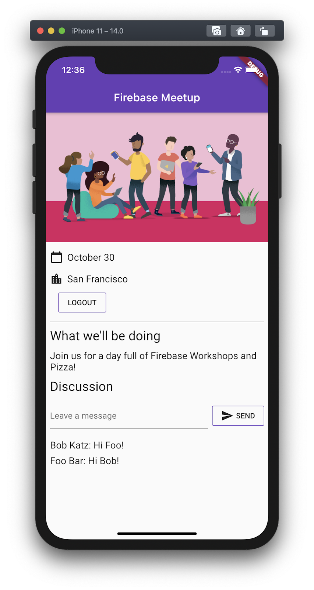 |
| --- | --- |
| 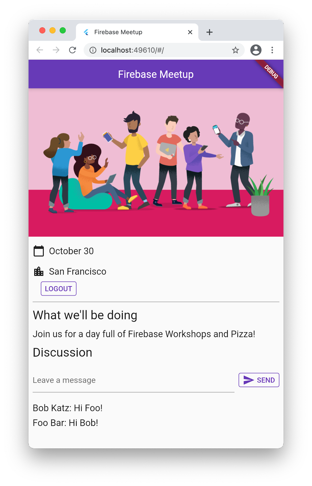 | 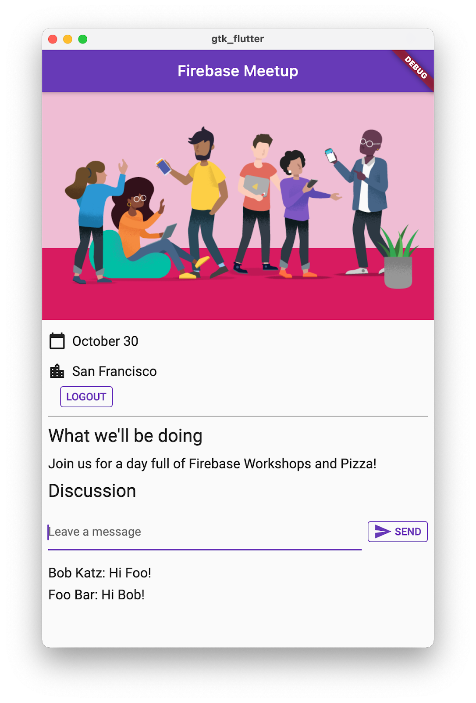 |


## Set up basic security rules
Duration: 05:00

You initially set up Firestore to use test mode, which means that your database is open for reads and writes. However, you should only use test mode during early stages of development. As a best practice, you should set up security rules for your database as you develop your app. Security is integral to your app's structure and behavior.

Firebase Security Rules let you control access to documents and collections in your database. The flexible rules syntax lets you create rules that match anything from all writes to the entire database to operations on a specific document.

Set up basic security rules:

1. In the Firebase console's **Develop** menu, click **Database > Rules**. You should see the following default security rules and a warning about the rules being public:

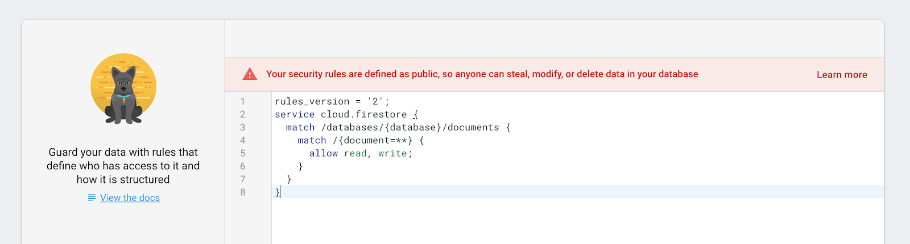

> aside positive
>
> To learn more about security rules, see  [Firebase Security Rules](https://firebase.google.com/docs/rules) and  [the Understanding Firebase Security Rules playlist on YouTube](https://www.youtube.com/watch?v=QEuu9X9L-MU&list=PLl-K7zZEsYLn8h1NyU_OV6dX8mBhH2s_L).

2. Identify the collections to which the app writes data:

In `match /databases/{database}/documents`, identify the collection that you want to secure:

```javascript
rules_version = '2';
service cloud.firestore {
  match /databases/{database}/documents {
    match /guestbook/{entry} {
     // You'll add rules here in the next step.
  }
}
```

Because you used the Authentication UID as a field in each guestbook document, you can get the Authentication UID and verify that anyone attempting to write to the document has a matching Authentication UID.

3. Add the read and write rules to your rule set:

```javascript
rules_version = '2';
service cloud.firestore {
  match /databases/{database}/documents {
    match /guestbook/{entry} {
      allow read: if request.auth.uid != null;
      allow write:
        if request.auth.uid == request.resource.data.userId;
    }
  }
}
```

Now, only signed-in users can read messages in the guest book, but only a message's author can edit a message.

4. Add data validation to ensure that all the expected fields are present in the document:

```javascript
rules_version = '2';
service cloud.firestore {
  match /databases/{database}/documents {
    match /guestbook/{entry} {
      allow read: if request.auth.uid != null;
      allow write:
      if request.auth.uid == request.resource.data.userId
          && "name" in request.resource.data
          && "text" in request.resource.data
          && "timestamp" in request.resource.data;
    }
  }
}
```


## Bonus step: Practice what you've learned


### Record an attendee's RSVP status

Right now, your app only allows people to chat when they're interested in the event. Also, the only way that you know whether someone's coming is when they say so in the chat.

In this step, you get organized and let people know how many people are coming. You add a couple of capabilities to the app state. The first is the ability for a logged-in user to nominate whether they're attending. The second is a counter of how many people are attending.

1. In the `lib/app_state.dart` file, add the following lines to the accessors section of the `ApplicationState` so that the UI code can interact with this state:

####  [lib/app_state.dart](https://github.com/flutter/codelabs/blob/master/firebase-get-to-know-flutter/step_09/lib/app_state.dart#L37)

```dart
int _attendees = 0;
int get attendees => _attendees;

Attending _attending = Attending.unknown;
StreamSubscription<DocumentSnapshot>? _attendingSubscription;
Attending get attending => _attending;
set attending(Attending attending) {
  final userDoc = FirebaseFirestore.instance
      .collection('attendees')
      .doc(FirebaseAuth.instance.currentUser!.uid);
  if (attending == Attending.yes) {
    userDoc.set(<String, dynamic>{'attending': true});
  } else {
    userDoc.set(<String, dynamic>{'attending': false});
  }
}
```

2. Update the `ApplicationState`'s `init()` method as follows:

####  [lib/app_state.dart](https://github.com/flutter/codelabs/blob/master/firebase-get-to-know-flutter/step_09/lib/app_state.dart#L80)

```dart
  Future<void> init() async {
    await Firebase.initializeApp(
        options: DefaultFirebaseOptions.currentPlatform);

    FirebaseUIAuth.configureProviders([
      EmailAuthProvider(),
    ]);

    // Add from here...
    FirebaseFirestore.instance
        .collection('attendees')
        .where('attending', isEqualTo: true)
        .snapshots()
        .listen((snapshot) {
      _attendees = snapshot.docs.length;
      notifyListeners();
    });
    // ...to here.

    FirebaseAuth.instance.userChanges().listen((user) {
      if (user != null) {
        _loginState = ApplicationLoginState.loggedIn;
        _guestBookSubscription = FirebaseFirestore.instance
            .collection('guestbook')
            .orderBy('timestamp', descending: true)
            .snapshots()
            .listen((snapshot) {
          _guestBookMessages = [];
          for (final document in snapshot.docs) {
            _guestBookMessages.add(
              GuestBookMessage(
                name: document.data()['name'] as String,
                message: document.data()['text'] as String,
              ),
            );
          }
          notifyListeners();
        });
        // Add from here...
        _attendingSubscription = FirebaseFirestore.instance
            .collection('attendees')
            .doc(user.uid)
            .snapshots()
            .listen((snapshot) {
          if (snapshot.data() != null) {
            if (snapshot.data()!['attending'] as bool) {
              _attending = Attending.yes;
            } else {
              _attending = Attending.no;
            }
          } else {
            _attending = Attending.unknown;
          }
          notifyListeners();
        });
        // ...to here.
      } else {
        _loginState = ApplicationLoginState.loggedOut;
        _guestBookMessages = [];
        _guestBookSubscription?.cancel();
        _attendingSubscription?.cancel(); // new
      }
      notifyListeners();
    });
  }
```

This code adds an always-subscribed query to determine the number of attendees and a second query that's only active while a user is logged in to determine whether the user is attending.

3. Add the following enumeration at the top of the `lib/app_state.dart` file.

####  [lib/app_state.dart](https://github.com/flutter/codelabs/blob/master/firebase-get-to-know-flutter/step_09/lib/app_state.dart#L5)

```dart
enum Attending { yes, no, unknown }
```

4. Create a new file `yes_no_selection.dart`, define a new widget that acts like radio buttons:

####  [lib/yes_no_selection.dart](https://github.com/flutter/codelabs/blob/master/firebase-get-to-know-flutter/step_09/lib/yes_no_selection.dart)

```dart
import 'package:flutter/material.dart';

import 'app_state.dart';
import 'src/widgets.dart';

class YesNoSelection extends StatelessWidget {
  const YesNoSelection(
      {super.key, required this.state, required this.onSelection});
  final Attending state;
  final void Function(Attending selection) onSelection;

  @override
  Widget build(BuildContext context) {
    switch (state) {
      case Attending.yes:
        return Padding(
          padding: const EdgeInsets.all(8.0),
          child: Row(
            children: [
              ElevatedButton(
                style: ElevatedButton.styleFrom(elevation: 0),
                onPressed: () => onSelection(Attending.yes),
                child: const Text('YES'),
              ),
              const SizedBox(width: 8),
              TextButton(
                onPressed: () => onSelection(Attending.no),
                child: const Text('NO'),
              ),
            ],
          ),
        );
      case Attending.no:
        return Padding(
          padding: const EdgeInsets.all(8.0),
          child: Row(
            children: [
              TextButton(
                onPressed: () => onSelection(Attending.yes),
                child: const Text('YES'),
              ),
              const SizedBox(width: 8),
              ElevatedButton(
                style: ElevatedButton.styleFrom(elevation: 0),
                onPressed: () => onSelection(Attending.no),
                child: const Text('NO'),
              ),
            ],
          ),
        );
      default:
        return Padding(
          padding: const EdgeInsets.all(8.0),
          child: Row(
            children: [
              StyledButton(
                onPressed: () => onSelection(Attending.yes),
                child: const Text('YES'),
              ),
              const SizedBox(width: 8),
              StyledButton(
                onPressed: () => onSelection(Attending.no),
                child: const Text('NO'),
              ),
            ],
          ),
        );
    }
  }
}
```

It starts in an indeterminate state with neither **Yes** nor **No** selected. Once the user selects whether they're attending, you show that option highlighted with a filled button and the other option recedes with a flat rendering.

5. Update `HomePage`'s `build()` method to take advantage of `YesNoSelection`, enable a logged-in user to nominate whether they're attending, and display the number of attendees for the event:

####  [lib/home_page.dart](https://github.com/flutter/codelabs/blob/master/firebase-get-to-know-flutter/step_09/lib/home_page.dart#L56)

```dart
Consumer<ApplicationState>(
  builder: (context, appState, _) => Column(
    crossAxisAlignment: CrossAxisAlignment.start,
    children: [
      // Add from here...
      if (appState.attendees >= 2)
        Paragraph('${appState.attendees} people going')
      else if (appState.attendees == 1)
        const Paragraph('1 person going')
      else
        const Paragraph('No one going'),
      // ...to here.
      if (appState.loggedIn) ...[
        // Add from here...
        YesNoSelection(
          state: appState.attending,
          onSelection: (attending) => appState.attending = attending,
        ),
        // ...to here.
        const Header('Discussion'),
        GuestBook(
          addMessage: (message) =>
              appState.addMessageToGuestBook(message),
          messages: appState.guestBookMessages,
        ),
      ],
    ],
  ),
),
```

### Add rules

You already set up some rules, so the data that you add with the buttons will be rejected. You need to update the rules to allow additions to the `attendees` collection.

1. In the `attendees` collection, grab the Authentication UID that you used as the document name and verify that the submitter's `uid` is the same as the document they're writing:

```javascript
rules_version = '2';
service cloud.firestore {
  match /databases/{database}/documents {
    // ... //
    match /attendees/{userId} {
      allow read: if true;
      allow write: if request.auth.uid == userId;
    }
  }
}
```

This lets everyone read the attendees list because there's no private data there, but only the creator can update it.

2. Add data validation to ensure that all the expected fields are present in the document:

```javascript
rules_version = '2';
service cloud.firestore {
  match /databases/{database}/documents {
    // ... //
    match /attendees/{userId} {
      allow read: if true;
      allow write: if request.auth.uid == userId
          && "attending" in request.resource.data;

    }
  }
}
```

3. Optional: In the app, click buttons to see the results in the Firestore dashboard in the Firebase console.

#### App preview

| <p align=center></p> |  |
| --- | --- |
|  |  |


## Congratulations!

You used Firebase to build an interactive, real-time web app!

### Learn more

* [Firebase](https://firebase.google.com)
* [Flutter](https://flutter.dev/)
* [FlutterFire](https://firebase.flutter.dev/)
* [Firebase YouTube channel](https://www.youtube.com/user/Firebase/featured)
* [Flutter YouTube channel](https://www.youtube.com/FlutterDev)
* [Firestore web codelab](https://codelabs.developers.google.com/codelabs/firestore-web)
* [Get to know Firestore YouTube playlist](https://www.youtube.com/watch?v=v_hR4K4auoQ&list=PLl-K7zZEsYLluG5MCVEzXAQ7ACZBCuZgZ&index=2&t=0s)
