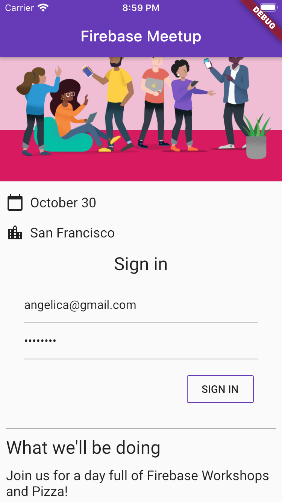

# Get to know Firebase for Flutter

[Codelab Feedback](https://github.com/flutter/flutter/issues/new)


## Before you begin
Duration: 01:00

In this codelab, you'll learn some of the basics of  [Firebase](http://firebase.google.com) to create Flutter mobile apps for Android and iOS.

<video id="wUSkeTaBonA?start=0&end=105&version=3"></video>


### Prerequisites

This codelab assumes you are familiar with Flutter, and you have installed the  [Flutter SDK](https://flutter.dev/get-started/install/), and  [an editor](https://flutter.dev/get-started/editor/).

### What you'll create

In this codelab you will build an event RSVP and guestbook chat app on Android, iOS, the Web, and macOS using Flutter. You will authenticate users with Firebase Authentication and sync data using Cloud Firestore.

|  |  |
| --- | --- |
|  |  |

### What you'll need

You can run this codelab using any of the following devices:

* A physical device (Android or iOS) connected to your computer and set to developer mode.
* The iOS simulator. (Requires  [installing Xcode tools](https://apps.apple.com/us/app/xcode/id497799835).)
* The Android emulator. (Requires setup in  [Android Studio](https://developer.android.com/studio/install).)

In addition to the above, you'll also need:

* A browser of your choice, such as Chrome.
* An IDE or text editor of your choice, such as  [Android Studio](https://developer.android.com/studio) or  [VS Code](https://code.visualstudio.com/) configured with the Dart and Flutter plugins.
* The latest `stable` version of  [Flutter](https://flutter.dev/docs/get-started/web#set-up) (or `beta` if you enjoy living on the edge).
* A Google account, like a gmail account, for creating and managing your Firebase project.
* The [`firebase` command line tool](https://firebase.google.com/docs/cli), logged into your gmail account.
* The codelab's sample code. See the next step for how to get the code.


## Get the sample code
Duration: 02:00

Let's start by downloading the initial version of our project from GitHub.

<video id="wUSkeTaBonA?start=105&end=296&version=3"></video>

Clone the  [GitHub repository](https://github.com/flutter/codelabs) from the command line:

```console
git clone https://github.com/flutter/codelabs.git flutter-codelabs
```

Alternatively, if you have  [GitHub's cli](https://github.com/cli/cli) tool installed:

```console
gh repo clone flutter/codelabs flutter-codelabs
```

The sample code should be cloned into the `flutter-codelabs` directory, which contains the code for a collection of codelabs. The code for this codelab is in `flutter-codelabs/firebase-get-to-know-flutter`.

The directory structure under `flutter-codelabs/firebase-get-to-know-flutter` is a series of snapshots of where you should be at the end of each named step. This is Step 2, so locating the matching files is as easy as:

```console
cd flutter-codelabs/firebase-get-to-know-flutter/step_02
```

If you want to skip forward, or see what something should look like after a step, look in the directory named after the step you are interested in.

### Import the starter app

Open or import the `flutter-codelabs/firebase-get-to-know-flutter/step_02` directory into your preferred IDE. This directory contains the starting code for the codelab which consists of a not-yet-functional Flutter meetup app.

### Locate the files to work on

The code in this app is spread over multiple directories. This split of functionality is designed to make it easier to work on, by grouping code by functionality.

Locate the following files in the project:

* `lib/main.dart`: This file contains the main entry point and the application widget.
* `lib/src/widgets.dart`: This file contains a handful of widgets to help standardise the styling of the application. These are used to compose the screen of the starter app.
* `lib/src/authentication.dart`: This file contains a partial implementation of  [FirebaseUI Auth](https://firebase.google.com/docs/auth) with a set of widgets to create a login user experience for Firebase email based authentication. These widgets for the auth flow are not yet used in the starter app, but you will wire them in soon.

You will add additional files as required to build out the rest of the application.

### Reviewing the `lib/main.dart` file

This app takes advantage of the  [`google_fonts`](https://pub.dev/packages/google_fonts) package to enable us to make Roboto the default font throughout the whole app. An exercise for the motivated reader is to explore  [fonts.google.com](https://fonts.google.com/) and use the fonts you discover there in different parts of the app.

You are utilising the helper widgets from `lib/src/widgets.dart` in the form of `Header`, `Paragraph` and `IconAndDetail`. These widgets reduce clutter in the page layout described in `HomePage` by eliminating duplicated code. This has the additional benefit of enabling a consistent look and feel.

Here is what your app looks like on Android, iOS, the Web and macOS:

#### **App preview**

|  |  |
| --- | --- |
|  |  |


## Create and set up a Firebase project
Duration: 07:00

Displaying the event information is great for your guests, but just showing the events isn't very useful for anybody. Let's add some dynamic functionality to this app. For this, you'll need to hook Firebase up to your app. To get started with Firebase, you'll need to create and set up a Firebase project.

<video id="wUSkeTaBonA?start=296&end=547&version=3"></video>


### **Create a Firebase project**

1. Sign in to  [Firebase](https://console.firebase.google.com/).
2. In the Firebase console, click **Add Project** (or **Create a project**), and name your Firebase project **Firebase-Flutter-Codelab**.


3. Click through the project creation options. Accept the Firebase terms if prompted. Skip setting up Google Analytics, because you won't be using Analytics for this app.


To learn more about Firebase projects, see  [Understand Firebase projects](https://www.google.com/url?q=https://firebase.google.com/docs/projects/learn-more&sa=D&ust=1568059744191000&usg=AFQjCNEo043D9nD4a1aS2AjK8ReenvZ3Pg).

The app that you're building uses several Firebase products that are available for web apps:

* **Firebase Authentication** to allow your users to sign in to your app.
* **Cloud Firestore** to save structured data on the cloud and get instant notification when data changes.
* **Firebase Security Rules** to secure your database.

Some of these products need special configuration or need to be enabled using the Firebase console.

### Enable email sign-in **for Firebase Authentication**

To allow users to sign in to the web app, you'll use the **Email/Password** sign-in method for this codelab:

1. In the Firebase console, expand the **Build** menu in the left panel.
2. Click **Authentication**, and then click the **Get Started** button, then the **Sign-in method** tab (or  [click here](https://console.firebase.google.com/project/_/authentication/providers) to go directly to the **Sign-in method** tab).
3. Click **Email/Password** in the **Sign-in providers** list, set the **Enable** switch to the on position, and then click **Save**.


### **Enable Cloud Firestore**

The web app uses  [Cloud Firestore](https://firebase.google.com/docs/firestore/) to save chat messages and receive new chat messages.

Enable Cloud Firestore:

1. In the Firebase console's **Build** section, click **Cloud Firestore**.
2. Click **Create database**.


> aside positive
>
> **Important:** Make sure to enable Cloud Firestore and *not* the Realtime Database for this codelab. To understand the difference between the two, please see  [this page](https://firebase.google.com/docs/database/rtdb-vs-firestore).

3. Select the **Start in test mode** option. Read the disclaimer about the security rules. Test mode ensures that you can freely write to the database during development. Click **Next**.


> aside negative
>
> **Caution:** In the first stages of this codelab, you use test mode. Later in the codelab, though, you'll write Firebase Security Rules to secure your database.
>
> For your apps, especially production apps, it's very important that you secure your database using security rules. Learn more about security rules in the  [Firebase documentation](https://firebase.google.com/docs/rules).

4. Select the location for your database (You can just use the default). Note that this location can't be changed later.

5. Click **Enable**.


## Firebase configuration
Duration: 08:00

> aside positive
>
> **Tip:** You only need to do one of the following configurations if you intend to only use iOS or Android. We offer instructions for both here for completeness sake.

In order to use Firebase with Flutter, you need to follow a process to configure the Flutter project to utilise the FlutterFire libraries correctly:

* Add the FlutterFire dependencies to your project
* Register the desired platform on the Firebase project
* Download the platform-specific configuration file, and add it to the code.

<video id="wUSkeTaBonA?start=547&end=963&version=3"></video>


> aside negative
>
> **Important**: You need to register all the platforms you want to use within the same Firebase project.

In the top-level directory of your Flutter app, there are subdirectories called `android`, `ios`, `macos` and `web`. These directories hold the platform-specific configuration files for iOS and Android, respectively.

### Configure dependencies

You need to add the FlutterFire libraries for the two Firebase products you are utilizing in this app - Firebase Auth and Cloud Firestore. Run the following three commands to add the depencies.

```console
$ flutter pub add firebase_core 
Resolving dependencies...
+ firebase_core 1.10.5
+ firebase_core_platform_interface 4.2.2
+ firebase_core_web 1.5.2
+ flutter_web_plugins 0.0.0 from sdk flutter
+ js 0.6.3
  test_api 0.4.3 (0.4.8 available)
Changed 5 dependencies!
```

The [`firebase_core`](https://pub.dev/packages/firebase_core) is the common code required for all Firebase Flutter plugins.

```console
$ flutter pub add firebase_auth
Resolving dependencies...
+ firebase_auth 3.3.3
+ firebase_auth_platform_interface 6.1.8
+ firebase_auth_web 3.3.4
+ intl 0.17.0
  test_api 0.4.3 (0.4.8 available)
Changed 4 dependencies!
```

The [`firebase_auth`](https://pub.dev/packages/firebase_auth) enables integration with Firebase's Authentication capability.

```console
$ flutter pub add cloud_firestore
Resolving dependencies...
+ cloud_firestore 3.1.4
+ cloud_firestore_platform_interface 5.4.9
+ cloud_firestore_web 2.6.4
  test_api 0.4.3 (0.4.8 available)
Changed 3 dependencies!
```

The [`cloud_firestore`](https://pub.dev/packages/cloud_firestore) enables access to Cloud Firestore data storage.

```console
$ flutter pub add provider
Resolving dependencies...
+ nested 1.0.0
+ provider 6.0.1
  test_api 0.4.3 (0.4.8 available)
Changed 2 dependencies!
```

While you have added the required packages, you also need to configure the iOS, Android, macOS and Web runner projects to appropriately utilise Firebase. You are also using the [`provider`](https://pub.dev/packages/provider) package that will enable separation of business logic from display logic.

### Installing `flutterfire`

The FlutterFire CLI depends on the underlying Firebase CLI. If you haven't done so already, ensure the [Firebase CLI](https://firebase.google.com/docs/cli) is installed on your machine.

Next, install the FlutterFire CLI by running the following command:

```console
$ dart pub global activate flutterfire_cli
```

Once installed, the `flutterfire` command will be globally available.

### Configuring your apps

The CLI extracts information from your Firebase project and selected project applications to generate all the configuration for a specific platform.

In the root of your application, run the configure command:

```console
$ flutterfire configure
```

The configuration command will guide you through a number of processes:

1. Selecting a Firebase project (based on the .firebaserc file or from the Firebase Console).
1. Prompt what platforms (e.g. Android, iOS, macOS & web) you would like configuration for.
1. Identify which Firebase applications for the chosen platforms should be used to extract configuration for. By default, the CLI will attempt to automatically match Firebase apps based on your current project configuration.
1. Generate a firebase_options.dart file in your project.

### Configure macOS

Flutter on macOS builds fully sandboxed applications. As this application is integrating using the network to communicate with the Firebase servers, you will need to configure your application with network client privileges. 

####  [macos/Runner/DebugProfile.entitlements](https://github.com/flutter/codelabs/blob/master/firebase-get-to-know-flutter/step_04/macos/Runner/DebugProfile.entitlements)
```xml
<?xml version="1.0" encoding="UTF-8"?>
<!DOCTYPE plist PUBLIC "-//Apple//DTD PLIST 1.0//EN" "http://www.apple.com/DTDs/PropertyList-1.0.dtd">
<plist version="1.0">
<dict>
	<key>com.apple.security.app-sandbox</key>
	<true/>
	<key>com.apple.security.cs.allow-jit</key>
	<true/>
	<key>com.apple.security.network.server</key>
	<true/>
  <!-- Add the following two lines -->
	<key>com.apple.security.network.client</key>
	<true/>
</dict>
</plist>
```

####  [macos/Runner/Release.entitlements](https://github.com/flutter/codelabs/blob/master/firebase-get-to-know-flutter/step_04/macos/Runner/Release.entitlements)
```xml
<?xml version="1.0" encoding="UTF-8"?>
<!DOCTYPE plist PUBLIC "-//Apple//DTD PLIST 1.0//EN" "http://www.apple.com/DTDs/PropertyList-1.0.dtd">
<plist version="1.0">
<dict>
	<key>com.apple.security.app-sandbox</key>
	<true/>
  <!-- Add the following two lines -->
	<key>com.apple.security.network.client</key>
	<true/>
</dict>
</plist>
```

See [Entitlements and the App Sandbox](https://docs.flutter.dev/desktop#entitlements-and-the-app-sandbox) for more detail.

## Add user sign-in (RSVP)
Duration: 10:00


Now that you've added Firebase to the app, you can set up an RSVP button that registers people using  [Firebase Authentication](https://firebase.google.com/docs/auth). For Android native, iOS native, and Web there are pre-built FirebaseUI Auth packages, but for Flutter you will need to build this capability.

<video id="wUSkeTaBonA?start=963&end=1571&version=3"></video>

The project you retrieved in Step 2 included a set of widgets that implements the user interface for most of the authentication flow. You will implement the business logic to integrate Firebase Authentication into the application.

### **Business Logic with Provider**

You are going to use the  [`provider`](https://pub.dev/packages/provider) package to make a centralized application state object available throughout the application's tree of Flutter widgets. To start with, modify the imports at the top of `lib/main.dart`:

####  [lib/main.dart](https://github.com/flutter/codelabs/blob/master/firebase-get-to-know-flutter/step_05/lib/main.dart#L1)

```dart
import 'package:firebase_auth/firebase_auth.dart'; // new
import 'package:firebase_core/firebase_core.dart'; // new
import 'package:flutter/material.dart';
import 'package:google_fonts/google_fonts.dart';
import 'package:provider/provider.dart';           // new

import 'firebase_options.dart';                    // new
import 'src/authentication.dart';                  // new
import 'src/widgets.dart';
```

The `import` lines introduce Firebase Core and Auth, pull in the `provider` package which you are using to make the application state object available through the widget tree, and include the authentication widgets from `lib/src`.

This application state object, `ApplicationState`, has two main responsibilities for this step, but will gain additional responsibilities as you add more capabilities to the application in later steps. The first responsibility is to initialize the Firebase library with a call to `Firebase.initializeApp()`, and then there is the handling of the authorization flow. Add the following class to the end of `lib/main.dart`:

####  [lib/main.dart](https://github.com/flutter/codelabs/blob/master/firebase-get-to-know-flutter/step_05/lib/main.dart#L83)

```dart
class ApplicationState extends ChangeNotifier {
  ApplicationState() {
    init();
  }

  Future<void> init() async {
    await Firebase.initializeApp(
      options: DefaultFirebaseOptions.currentPlatform,
    );

    FirebaseAuth.instance.userChanges().listen((user) {
      if (user != null) {
        _loginState = ApplicationLoginState.loggedIn;
      } else {
        _loginState = ApplicationLoginState.loggedOut;
      }
      notifyListeners();
    });
  }

  ApplicationLoginState _loginState = ApplicationLoginState.loggedOut;
  ApplicationLoginState get loginState => _loginState;

  String? _email;
  String? get email => _email;

  void startLoginFlow() {
    _loginState = ApplicationLoginState.emailAddress;
    notifyListeners();
  }

  Future<void> verifyEmail(
    String email,
    void Function(FirebaseAuthException e) errorCallback,
  ) async {
    try {
      var methods =
          await FirebaseAuth.instance.fetchSignInMethodsForEmail(email);
      if (methods.contains('password')) {
        _loginState = ApplicationLoginState.password;
      } else {
        _loginState = ApplicationLoginState.register;
      }
      _email = email;
      notifyListeners();
    } on FirebaseAuthException catch (e) {
      errorCallback(e);
    }
  }

  Future<void> signInWithEmailAndPassword(
    String email,
    String password,
    void Function(FirebaseAuthException e) errorCallback,
  ) async {
    try {
      await FirebaseAuth.instance.signInWithEmailAndPassword(
        email: email,
        password: password,
      );
    } on FirebaseAuthException catch (e) {
      errorCallback(e);
    }
  }

  void cancelRegistration() {
    _loginState = ApplicationLoginState.emailAddress;
    notifyListeners();
  }

  Future<void> registerAccount(
      String email,
      String displayName,
      String password,
      void Function(FirebaseAuthException e) errorCallback) async {
    try {
      var credential = await FirebaseAuth.instance
          .createUserWithEmailAndPassword(email: email, password: password);
      await credential.user!.updateDisplayName(displayName);
    } on FirebaseAuthException catch (e) {
      errorCallback(e);
    }
  }

  void signOut() {
    FirebaseAuth.instance.signOut();
  }
}
```

It is worth noting a few key points in this class. The user starts off unauthenticated, the app shows a form requesting the user's email address, depending on whether that email address is on file, the app will either ask the user register, or request their password, and then assuming everything works out, the user is authenticated.

It must be noted that this isn't a complete implementation of the FirebaseUI Auth flow, as it does not handle the case of a user with an existing account who is having trouble logging in. Implementing this additional capability is left as an exercise to the motivated reader.

### **Integrating the Authentication flow**

Now that you have the start of the application state it is time to wire the application state into the app initialization and add the authentication flow into `HomePage`. Update the main entry point to integrate application state via the `provider` package:

####  [lib/main.dart](https://github.com/flutter/codelabs/blob/master/firebase-get-to-know-flutter/step_05/lib/main.dart#L10)

```dart
void main() {
  // Modify from here
  runApp(
    ChangeNotifierProvider(
      create: (context) => ApplicationState(),
      builder: (context, _) => App(),
    ),
  );
  // to here.
}
```

The modification to the `main` function makes the provider package responsible for instantiating the application state object using the `ChangeNotifierProvider` widget. You are using this specific provider class because the application state object extends `ChangeNotifier` and this enables the `provider` package to know when to redisplay dependent widgets. Finally, integrate the application state with `Authentication` by updating `HomePage`‘s `build` method:

####  [lib/main.dart](https://github.com/flutter/codelabs/blob/master/firebase-get-to-know-flutter/step_05/lib/main.dart#L54)

```dart
class HomePage extends StatelessWidget {
  const HomePage({Key? key}) : super(key: key);

  @override
  Widget build(BuildContext context) {
    return Scaffold(
      appBar: AppBar(
        title: const Text('Firebase Meetup'),
      ),
      body: ListView(
        children: <Widget>[
          Image.asset('assets/codelab.png'),
          const SizedBox(height: 8),
          const IconAndDetail(Icons.calendar_today, 'October 30'),
          const IconAndDetail(Icons.location_city, 'San Francisco'),
          // Add from here
          Consumer<ApplicationState>(
            builder: (context, appState, _) => Authentication(
              email: appState.email,
              loginState: appState.loginState,
              startLoginFlow: appState.startLoginFlow,
              verifyEmail: appState.verifyEmail,
              signInWithEmailAndPassword: appState.signInWithEmailAndPassword,
              cancelRegistration: appState.cancelRegistration,
              registerAccount: appState.registerAccount,
              signOut: appState.signOut,
            ),
          ),
          // to here
          const Divider(
            height: 8,
            thickness: 1,
            indent: 8,
            endIndent: 8,
            color: Colors.grey,
          ),
          const Header("What we'll be doing"),
          const Paragraph(
            'Join us for a day full of Firebase Workshops and Pizza!',
          ),
        ],
      ),
    );
  }
}
```

You instantiate the `Authentication` widget, and wrap it in a `Consumer` widget. The Consumer widget the usual way that the `provider` package can be used to rebuild part of the tree when the application state changes. The `Authentication` widget is the authentication UI that you will now test.

#### **Testing the Authentication flow**


Here is the start of the authentication flow, where the user can tap on the RSVP button, to initiate the email form.


Upon entering the email, the system confirms if the user is already registered, in which case the user is prompted for a password, alternatively if the user isn't registered, then they go through the registration form.


Make sure to try out entering a short password (less than six characters) to check the error handling flow. If the user is registered, they will see the password for instead.



On this page make sure to enter incorrect passwords to check the error handling on this page. Finally, once the user is logged in, you will see the logged in experience which offers the user the ability to log out again.


And with that, you have implemented an authentication flow. Congrats!


## Write messages to Cloud Firestore
Duration: 10:00


Knowing that users are coming is great, but let's give the guests something else to do in the app. What if they could leave messages in a guestbook? They can share why they're excited to come or who they hope to meet.

<video id="wUSkeTaBonA?start=1571&end=1941&version=3"></video>


To store the chat messages that users write in the app, you'll use  [Cloud Firestore](https://firebase.google.com/docs/firestore/).

### **Data model**

Cloud Firestore is a NoSQL database, and data stored in the database is split into collections, documents, fields, and subcollections. You will store each message of the chat as a document in a top-level collection called `guestbook`.


> aside positive
>
> **Tip**: To learn more about the Cloud Firestore data model, read about documents and collections in  [the Cloud Firestore documentation](https://firebase.google.com/docs/firestore/data-model). You can also watch a  [great series of videos](https://www.youtube.com/playlist?list=PLl-K7zZEsYLluG5MCVEzXAQ7ACZBCuZgZ) that describe the Cloud Firestore NoSQL data model, queries, and other cool things that you can do with Cloud Firestore.

### Add messages to Firestore

In this section, you'll add the functionality for users to write new messages to the database. First, you add the UI elements (form field and send button), and then you add the code that hooks these elements up to the database.

First, add imports for the `cloud_firestore` package and `dart:async`.

####  [lib/main.dart](https://github.com/flutter/codelabs/blob/master/firebase-get-to-know-flutter/step_06/lib/main.dart)

```dart
import 'dart:async';                                    // new

import 'package:cloud_firestore/cloud_firestore.dart';  // new
import 'package:firebase_auth/firebase_auth.dart';
import 'package:firebase_core/firebase_core.dart';
import 'package:flutter/material.dart';
import 'package:google_fonts/google_fonts.dart';
import 'package:provider/provider.dart';

import 'firebase_options.dart';
import 'src/authentication.dart';
import 'src/widgets.dart';
```

To construct the UI elements of a message field and a send button, add a new stateful widget `GuestBook` at the bottom of `lib/main.dart`.

####  [lib/main.dart](https://github.com/flutter/codelabs/blob/master/firebase-get-to-know-flutter/step_06/lib/main.dart#L199)

```dart
class GuestBook extends StatefulWidget {
  const GuestBook({required this.addMessage});
  final FutureOr<void> Function(String message) addMessage;

  @override
  _GuestBookState createState() => _GuestBookState();
}

class _GuestBookState extends State<GuestBook> {
  final _formKey = GlobalKey<FormState>(debugLabel: '_GuestBookState');
  final _controller = TextEditingController();

  @override
  Widget build(BuildContext context) {
    return Padding(
      padding: const EdgeInsets.all(8.0),
      child: Form(
        key: _formKey,
        child: Row(
          children: [
            Expanded(
              child: TextFormField(
                controller: _controller,
                decoration: const InputDecoration(
                  hintText: 'Leave a message',
                ),
                validator: (value) {
                  if (value == null || value.isEmpty) {
                    return 'Enter your message to continue';
                  }
                  return null;
                },
              ),
            ),
            const SizedBox(width: 8),
            StyledButton(
              onPressed: () async {
                if (_formKey.currentState!.validate()) {
                  await widget.addMessage(_controller.text);
                  _controller.clear();
                }
              },
              child: Row(
                children: const [
                  Icon(Icons.send),
                  SizedBox(width: 4),
                  Text('SEND'),
                ],
              ),
            ),
          ],
        ),
      ),
    );
  }
}
```

There are a couple of points of interest here. First up, you are instantiating a Form so you can validate the message actually has some content, and show the user an error message if there isn't any. The way to validate a form involves accessing the form state behind the form, and for this you use a `GlobalKey`. For more information on Keys, and how to use them, please see the  [Flutter Widgets 101 episode "When to Use Keys"](https://www.youtube.com/watch?v=kn0EOS-ZiIc).

Also note the way the widgets are laid out, you have a `Row`, with a `TextFormField` and a `StyledButton`, which itself contains a `Row`. Also note the `TextFormField` is wrapped in an `Expanded` widget, this forces the `TextFormField` to take up any extra space in the row. To better understand why this is required, please read through  [Understanding constraints](https://flutter.dev/docs/development/ui/layout/constraints).

Now that you have a widget that enables the user to enter some text to add to the Guest Book, you need to get it on the screen. To do so, edit the body of `HomePage` to add the following two lines at the bottom of the `ListView`'s children:

```dart
const Header("What we'll be doing"),
const Paragraph(
  'Join us for a day full of Firebase Workshops and Pizza!',
),
// Add the following two lines.
const Header('Discussion'),
GuestBook(addMessage: (message) => print(message)),
```

While this is enough to display the Widget, it isn't sufficient to do anything useful. You will update this code shortly to make it functional.

#### App preview

|  |  |
| --- | --- |
|  |  |

A user clicking the **SEND** button will trigger the code snippet below. It adds the contents of the message input field to the `guestbook` collection of the database. Specifically, the `addMessageToGuestBook` method adds the message content to a new document (with an automatically generated ID) to the `guestbook` collection.

Note that `FirebaseAuth.instance.currentUser.uid` is a reference to the auto-generated unique ID that Firebase Authentication gives for all logged-in users.

Make another change to the `lib/main.dart` file. Add the `addMessageToGuestBook` method. You will wire the user interface and this capability together in the next step.

####  [lib/main.dart](https://github.com/flutter/codelabs/blob/master/firebase-get-to-know-flutter/step_06/lib/main.dart#L181)

```dart
class ApplicationState extends ChangeNotifier {

  // Current content of ApplicationState elided ...

  // Add from here
  Future<DocumentReference> addMessageToGuestBook(String message) {
    if (_loginState != ApplicationLoginState.loggedIn) {
      throw Exception('Must be logged in');
    }

    return FirebaseFirestore.instance
        .collection('guestbook')
        .add(<String, dynamic>{
      'text': message,
      'timestamp': DateTime.now().millisecondsSinceEpoch,
      'name': FirebaseAuth.instance.currentUser!.displayName,
      'userId': FirebaseAuth.instance.currentUser!.uid,
    });
  }
  // To here
}
```

### Wiring the UI into the database

You have a UI where the user can enter the text they want to add to the Guest Book, and you have the code to add the entry to Cloud Firestore. Now all you need to do is wire the two together. In `lib/main.dart` make the following change to the `HomePage` widget.

####  [lib/main.dart](https://github.com/flutter/codelabs/blob/master/firebase-get-to-know-flutter/step_06/lib/main.dart#L40)

```dart
class HomePage extends StatelessWidget {
  const HomePage({Key? key}) : super(key: key);

  @override
  Widget build(BuildContext context) {
    return Scaffold(
      appBar: AppBar(
        title: const Text('Firebase Meetup'),
      ),
      body: ListView(
        children: <Widget>[
          Image.asset('assets/codelab.png'),
          const SizedBox(height: 8),
          const IconAndDetail(Icons.calendar_today, 'October 30'),
          const IconAndDetail(Icons.location_city, 'San Francisco'),
          Consumer<ApplicationState>(
            builder: (context, appState, _) => Authentication(
              email: appState.email,
              loginState: appState.loginState,
              startLoginFlow: appState.startLoginFlow,
              verifyEmail: appState.verifyEmail,
              signInWithEmailAndPassword: appState.signInWithEmailAndPassword,
              cancelRegistration: appState.cancelRegistration,
              registerAccount: appState.registerAccount,
              signOut: appState.signOut,
            ),
          ),
          const Divider(
            height: 8,
            thickness: 1,
            indent: 8,
            endIndent: 8,
            color: Colors.grey,
          ),
          const Header("What we'll be doing"),
          const Paragraph(
            'Join us for a day full of Firebase Workshops and Pizza!',
          ),
          // Modify from here
          Consumer<ApplicationState>(
            builder: (context, appState, _) => Column(
              crossAxisAlignment: CrossAxisAlignment.start,
              children: [
                if (appState.loginState == ApplicationLoginState.loggedIn) ...[
                  const Header('Discussion'),
                  GuestBook(
                    addMessage: (message) =>
                        appState.addMessageToGuestBook(message),
                  ),
                ],
              ],
            ),
          ),
          // To here.
        ],
      ),
    );
  }
}
```

You have replaced the two lines you added back at the start of this step with the full implementation. You are again using `Consumer&lt;ApplicationState&gt;` to make the application state available to the part of the tree you are rendering. This enables you to react to someone entering a message in the UI, and publish it into the database. In the next section you will test if the added messages are published into the database.

### Test sending messages

1. Make sure that you're signed in to the app.
2. Enter a message such as "Hey there!", and then click **SEND**.

This action writes the message to your Cloud Firestore database. However, you won't yet see the message in your actual Flutter app because you still need to implement retrieving the data. You'll do that in the next step.

But you can see the newly added message in the Firebase console.

In the Firebase console, in the  [**Database** dashboard](https://console.firebase.google.com/project/_/database), you should see the `guestbook` collection with your newly added message. If you keep sending messages, your guestbook collection will contain many documents, like this:

#### **Firebase console**


## Read messages
Duration: 10:00

It's lovely that guests can write messages to the database, but they can't see them in the app yet. Let's fix that!

<video id="wUSkeTaBonA?start=1941&end=2444&version=3"></video>


### **Synchronize messages**

To display messages, you'll need to add listeners that trigger when data changes and then create a UI element that shows new messages. You'll add code to the application state that listens for newly added messages from the app.

Just above the `GuestBook` widget the following value class. This class exposes a structured view of the data you are storing in Cloud Firestore.

####  [lib/main.dart](https://github.com/flutter/codelabs/blob/master/firebase-get-to-know-flutter/step_07/lib/main.dart#L225)

```dart
class GuestBookMessage {
  GuestBookMessage({required this.name, required this.message});
  final String name;
  final String message;
}
```

In the section of `ApplicationState` where you define state and getters, add the following new lines:

####  [lib/main.dart](https://github.com/flutter/codelabs/blob/master/firebase-get-to-know-flutter/step_07/lib/main.dart#L140)

```dart
  ApplicationLoginState _loginState = ApplicationLoginState.loggedOut;
  ApplicationLoginState get loginState => _loginState;

  String? _email;
  String? get email => _email;

  // Add from here
  StreamSubscription<QuerySnapshot>? _guestBookSubscription;
  List<GuestBookMessage> _guestBookMessages = [];
  List<GuestBookMessage> get guestBookMessages => _guestBookMessages;
  // to here.
```

And finally, in the initialization section of `ApplicationState`, add the following to subscribe to a query over the document collection when a user logs in, and unsubscribe when they log out.

####  [lib/main.dart](https://github.com/flutter/codelabs/blob/master/firebase-get-to-know-flutter/step_07/lib/main.dart#L105)

```dart
  Future<void> init() async {
    await Firebase.initializeApp(
      options: DefaultFirebaseOptions.currentPlatform,
    );

    FirebaseAuth.instance.userChanges().listen((user) {
      if (user != null) {
        _loginState = ApplicationLoginState.loggedIn;
        // Add from here
        _guestBookSubscription = FirebaseFirestore.instance
            .collection('guestbook')
            .orderBy('timestamp', descending: true)
            .snapshots()
            .listen((snapshot) {
          _guestBookMessages = [];
          for (final document in snapshot.docs) {
            _guestBookMessages.add(
              GuestBookMessage(
                name: document.data()['name'] as String,
                message: document.data()['text'] as String,
              ),
            );
          }
          notifyListeners();
        });
        // to here.
      } else {
        _loginState = ApplicationLoginState.loggedOut;
        // Add from here
        _guestBookMessages = [];
        _guestBookSubscription?.cancel();
        // to here.
      }
      notifyListeners();
    });
  }
```

This section is important, as here is where you construct a query over the `guestbook` collection, and handle subscribing and unsubscribing to this collection. You listen to the stream, where you reconstruct a local cache of the messages in the `guestbook` collection, and also store a reference to this subscription so you can unsubscribe from it later. There is a lot going on here, and it is worth spending some time in a debugger inspecting what happens when to get a clearer mental model.

For more information, see the  [Cloud Firestore documentation](https://firebase.google.com/docs/firestore/query-data/listen).

> aside positive
>
> **Tip**: For a faster refresh, you can update only the changed documents, instead of the whole list. Learn more in the  [Cloud Firestore documentation](https://firebase.google.com/docs/firestore/query-data/listen#view_changes_between_snapshots).

In the `GuestBook` widget you need to connect this changing state to the user interface. You modify the widget by adding a list of messages as part of its configuration.

####  [lib/main.dart](https://github.com/flutter/codelabs/blob/master/firebase-get-to-know-flutter/step_07/lib/main.dart#L231)

```dart
class GuestBook extends StatefulWidget {
  // Modify the following line
  const GuestBook({required this.addMessage, required this.messages});
  final FutureOr<void> Function(String message) addMessage;
  final List<GuestBookMessage> messages; // new

  @override
  _GuestBookState createState() => _GuestBookState();
}
```

Next, we expose this new configuration in `_GuestBookState` by modifying the `build` method as follows.

####  [lib/main.dart](https://github.com/flutter/codelabs/blob/master/firebase-get-to-know-flutter/step_07/lib/main.dart#L241)

```dart
class _GuestBookState extends State<GuestBook> {
  final _formKey = GlobalKey<FormState>(debugLabel: '_GuestBookState');
  final _controller = TextEditingController();

  @override
  // Modify from here
  Widget build(BuildContext context) {
    return Column(
      crossAxisAlignment: CrossAxisAlignment.start,
      children: [
        // to here.
        Padding(
          padding: const EdgeInsets.all(8.0),
          child: Form(
            key: _formKey,
            child: Row(
              children: [
                Expanded(
                  child: TextFormField(
                    controller: _controller,
                    decoration: const InputDecoration(
                      hintText: 'Leave a message',
                    ),
                    validator: (value) {
                      if (value == null || value.isEmpty) {
                        return 'Enter your message to continue';
                      }
                      return null;
                    },
                  ),
                ),
                const SizedBox(width: 8),
                StyledButton(
                  onPressed: () async {
                    if (_formKey.currentState!.validate()) {
                      await widget.addMessage(_controller.text);
                      _controller.clear();
                    }
                  },
                  child: Row(
                    children: const [
                      Icon(Icons.send),
                      SizedBox(width: 4),
                      Text('SEND'),
                    ],
                  ),
                ),
              ],
            ),
          ),
        ),
        // Modify from here
        const SizedBox(height: 8),
        for (var message in widget.messages)
          Paragraph('${message.name}: ${message.message}'),
        const SizedBox(height: 8),
      ],
      // to here.
    );
  }
}
```

You wrap the previous content of the build method with a `Column` widget, and then at the tail of the `Column`'s children you add a  [collection for](https://dart.dev/guides/language/language-tour#collection-operators) to generate a new `Paragraph` for each message in the list of messages.

Finally, you now need to update the body of `HomePage` to correctly construct `GuestBook` with the new `messages` parameter.

####  [lib/main.dart](https://github.com/flutter/codelabs/blob/master/firebase-get-to-know-flutter/step_07/lib/main.dart#L79)

```dart
Consumer<ApplicationState>(
  builder: (context, appState, _) => Column(
    crossAxisAlignment: CrossAxisAlignment.start,
    children: [
      if (appState.loginState == ApplicationLoginState.loggedIn) ...[
        const Header('Discussion'),
        GuestBook(
          addMessage: (message) =>
              appState.addMessageToGuestBook(message),
          messages: appState.guestBookMessages, // new
        ),
      ],
    ],
  ),
),
```

### Test synchronizing messages

Cloud Firestore automatically and instantly synchronizes data with clients subscribed to the database.

1. The messages that you created earlier in the database should be displayed in the app. Feel free to write new messages; they should appear instantly.
2. If you open your workspace in multiple windows or tabs, messages will sync in real time across tabs.
3. *(Optional)* You can try manually deleting, modifying, or adding new messages directly in the **Database** section of the Firebase console; any changes should appear in the UI.

Congratulations! You are reading Cloud Firestore documents in your app!

#### App p**review**

|  |  |
| --- | --- |
|  |  |


## Set up basic security rules
Duration: 05:00

You initially set up Cloud Firestore to use test mode, meaning that your database is open for reads and writes. However, you should only use test mode during very early stages of development. As a best practice, you should set up security rules for your database as you develop your app. Security should be integral to your app's structure and behavior.

<video id="wUSkeTaBonA?start=2444&end=2809&version=3"></video>

Security Rules allow you to control access to documents and collections in your database. The flexible rules syntax allows you to create rules that match anything from all writes to the entire database to operations on a specific document.

You can write security rules for Cloud Firestore in the Firebase console:

1. In the Firebase console's **Develop** section, click **Database**, and then select the **Rules** tab (or  [click here](https://console.firebase.google.com/project/_/database/firestore/rules) to go directly to the **Rules** tab).
2. You should see the following default security rules, along with a warning about the rules being public.


> aside positive
>
> Check out the  [Firebase Security Rules documentation](https://firebase.google.com/docs/rules) or this  [YouTube playlist](https://www.youtube.com/watch?v=QEuu9X9L-MU&list=PLl-K7zZEsYLn8h1NyU_OV6dX8mBhH2s_L) to learn more about security rules.

### Identify collections

First, identify the collections to which the app writes data.

In `match /databases/{database}/documents`, identify the collection that you want to secure:

```javascript
rules_version = '2';
service cloud.firestore {
  match /databases/{database}/documents {
    match /guestbook/{entry} {
     // You'll add rules here in the next step.
  }
}
```

### **Add security rules**

Because you used the Authentication UID as a field in each guestbook document, you can get the Authentication UID and verify that anyone attempting to write to the document has a matching Authentication UID.

Add the read and write rules to your rule set as shown below:

```javascript
rules_version = '2';
service cloud.firestore {
  match /databases/{database}/documents {
    match /guestbook/{entry} {
      allow read: if request.auth.uid != null;
      allow write:
        if request.auth.uid == request.resource.data.userId;
    }
  }
}
```

Now, for the guestbook, only signed-in users can read messages (any message!), but only a message's author can edit a message.

### **Add validation rules**

Add data validation to make sure that all of the expected fields are present in the document:

```javascript
rules_version = '2';
service cloud.firestore {
  match /databases/{database}/documents {
    match /guestbook/{entry} {
      allow read: if request.auth.uid != null;
      allow write:
      if request.auth.uid == request.resource.data.userId
          && "name" in request.resource.data
          && "text" in request.resource.data
          && "timestamp" in request.resource.data;
    }
  }
}
```


## Bonus step: Practice what you've learned


### **Record an attendee's RSVP status**

Right now, your app just allows people to start chatting if they're interested in the event. Also, the only way you know if someone's coming is if they post it in the chat. Let's get organized and let people know how many people are coming.

<video id="wUSkeTaBonA?start=2809&end=3401&version=3"></video>


You are going to add a couple of new capabilities to the application state. The first is the ability for a logged in user to nominate if they are attending or not. The second capability is a counter of how many people are actually attending.

In `lib/main.dart`, add the following to the accessors section to enable the UI code to interact with this state:

####  [lib/main.dart](https://github.com/flutter/codelabs/blob/master/firebase-get-to-know-flutter/step_09/lib/main.dart#L190)

```dart
int _attendees = 0;
int get attendees => _attendees;

Attending _attending = Attending.unknown;
StreamSubscription<DocumentSnapshot>? _attendingSubscription;
Attending get attending => _attending;
set attending(Attending attending) {
  final userDoc = FirebaseFirestore.instance
      .collection('attendees')
      .doc(FirebaseAuth.instance.currentUser!.uid);
  if (attending == Attending.yes) {
    userDoc.set(<String, dynamic>{'attending': true});
  } else {
    userDoc.set(<String, dynamic>{'attending': false});
  }
}
```

Update `ApplicationState`'s `init` method as follows:

####  [lib/main.dart](https://github.com/flutter/codelabs/blob/master/firebase-get-to-know-flutter/step_09/lib/main.dart#L119)

```dart
  Future<void> init() async {
    await Firebase.initializeApp(
      options: DefaultFirebaseOptions.currentPlatform,
    );

    // Add from here
    FirebaseFirestore.instance
        .collection('attendees')
        .where('attending', isEqualTo: true)
        .snapshots()
        .listen((snapshot) {
      _attendees = snapshot.docs.length;
      notifyListeners();
    });
    // To here

    FirebaseAuth.instance.userChanges().listen((user) {
      if (user != null) {
        _loginState = ApplicationLoginState.loggedIn;
        _guestBookSubscription = FirebaseFirestore.instance
            .collection('guestbook')
            .orderBy('timestamp', descending: true)
            .snapshots()
            .listen((snapshot) {
          _guestBookMessages = [];
          for (final document in snapshot.docs) {
            _guestBookMessages.add(
              GuestBookMessage(
                name: document.data()['name'] as String,
                message: document.data()['text'] as String,
              ),
            );
          }
          notifyListeners();
        });
        // Add from here
        _attendingSubscription = FirebaseFirestore.instance
            .collection('attendees')
            .doc(user.uid)
            .snapshots()
            .listen((snapshot) {
          if (snapshot.data() != null) {
            if (snapshot.data()!['attending'] as bool) {
              _attending = Attending.yes;
            } else {
              _attending = Attending.no;
            }
          } else {
            _attending = Attending.unknown;
          }
          notifyListeners();
        });
        // to here
      } else {
        _loginState = ApplicationLoginState.loggedOut;
        _guestBookMessages = [];
        _guestBookSubscription?.cancel();
        _attendingSubscription?.cancel(); // new
      }
      notifyListeners();
    });
  }
```

The above adds an always subscribed query to find out the number of attendees, and a second query that is only active while a user is logged in to find out if the user is attending. Next, add the following enumeration after the `GuestBookMessage` declaration:

####  [lib/main.dart](https://github.com/flutter/codelabs/blob/master/firebase-get-to-know-flutter/step_09/lib/main.dart#L279)

```dart
enum Attending { yes, no, unknown }
```

You are now going to define a new widget that acts like radio buttons of old. It starts off in an indeterminate state, with neither yes nor no selected, but once the user selects whether they are attending or not, then you show that option highlighted with a filled button, and the other option receding with a flat rendering.

####  [lib/main.dart](https://github.com/flutter/codelabs/blob/master/firebase-get-to-know-flutter/step_09/lib/main.dart#L355)

```dart
class YesNoSelection extends StatelessWidget {
  const YesNoSelection({required this.state, required this.onSelection});
  final Attending state;
  final void Function(Attending selection) onSelection;

  @override
  Widget build(BuildContext context) {
    switch (state) {
      case Attending.yes:
        return Padding(
          padding: const EdgeInsets.all(8.0),
          child: Row(
            children: [
              ElevatedButton(
                style: ElevatedButton.styleFrom(elevation: 0),
                onPressed: () => onSelection(Attending.yes),
                child: const Text('YES'),
              ),
              const SizedBox(width: 8),
              TextButton(
                onPressed: () => onSelection(Attending.no),
                child: const Text('NO'),
              ),
            ],
          ),
        );
      case Attending.no:
        return Padding(
          padding: const EdgeInsets.all(8.0),
          child: Row(
            children: [
              TextButton(
                onPressed: () => onSelection(Attending.yes),
                child: const Text('YES'),
              ),
              const SizedBox(width: 8),
              ElevatedButton(
                style: ElevatedButton.styleFrom(elevation: 0),
                onPressed: () => onSelection(Attending.no),
                child: const Text('NO'),
              ),
            ],
          ),
        );
      default:
        return Padding(
          padding: const EdgeInsets.all(8.0),
          child: Row(
            children: [
              StyledButton(
                onPressed: () => onSelection(Attending.yes),
                child: const Text('YES'),
              ),
              const SizedBox(width: 8),
              StyledButton(
                onPressed: () => onSelection(Attending.no),
                child: const Text('NO'),
              ),
            ],
          ),
        );
    }
  }
}
```

Next, you need to update `HomePage`'s build method to take advantage of `YesNoSelection`, enabling a logged in user to nominate if they are attending. You will also display the number of attendees for this event.

####  [lib/main.dart](https://github.com/flutter/codelabs/blob/master/firebase-get-to-know-flutter/step_09/lib/main.dart#L79)

```dart
Consumer<ApplicationState>(
  builder: (context, appState, _) => Column(
    crossAxisAlignment: CrossAxisAlignment.start,
    children: [
      // Add from here
      if (appState.attendees >= 2)
        Paragraph('${appState.attendees} people going')
      else if (appState.attendees == 1)
        const Paragraph('1 person going')
      else
        const Paragraph('No one going'),
      // To here.
      if (appState.loginState == ApplicationLoginState.loggedIn) ...[
        // Add from here
        YesNoSelection(
          state: appState.attending,
          onSelection: (attending) => appState.attending = attending,
        ),
        // To here.
        const Header('Discussion'),
        GuestBook(
          addMessage: (message) =>
              appState.addMessageToGuestBook(message),
          messages: appState.guestBookMessages,
        ),
      ],
    ],
  ),
),
```

### **Add rules**

Because you already have some rules set up, the new data that you're adding with the buttons is going to be rejected. You'll need to update the rules to allow adding to the `attendees` collection.

For the `attendees` collection, since you used the Authentication UID as the document name, you can grab it and verify that the submitter's `uid` is the same as the document they are writing. You'll allow everyone to read the attendees list (since there is no private data there), but only the creator should be able to update it.

```javascript
rules_version = '2';
service cloud.firestore {
  match /databases/{database}/documents {
    // ... //
    match /attendees/{userId} {
      allow read: if true;
      allow write: if request.auth.uid == userId;
    }
  }
}
```

### **Add validation rules**

Add data validation to make sure that all of the expected fields are present in the document:

```javascript
rules_version = '2';
service cloud.firestore {
  match /databases/{database}/documents {
    // ... //
    match /attendees/{userId} {
      allow read: if true;
      allow write: if request.auth.uid == userId
          && "attending" in request.resource.data;

    }
  }
}
```

*(Optional)* You can now view the results of clicking the buttons. Go to your Cloud Firestore dashboard in the Firebase console.

#### App preview

|  |  |
| --- | --- |
|  |  |


## Congratulations!

You've used Firebase to build an interactive, real-time web application!

<video id="wUSkeTaBonA?start=3401&version=3"></video>


### **What we've covered**

* Firebase Authentication
* Cloud Firestore
* Firebase Security Rules

### Next steps

* **Want to learn more about other Firebase products?** Maybe you want to store image files that users upload? Or send notifications to your users? Check out the  [Firebase documentation](https://firebase.google.com/). Want to learn more about Flutter plugins for Firebase? Check out  [FlutterFire](https://firebase.flutter.dev/) for more information.
* **Want to learn more about Cloud Firestore?** Maybe you want to learn about subcollections and transactions? Head over to the  [**Cloud Firestore web codelab**](https://codelabs.developers.google.com/codelabs/firestore-web/#0) for a codelab that goes into more depth on Cloud Firestore. Or check out this  [**YouTube series to get to know Cloud Firestore**](https://www.youtube.com/watch?v=v_hR4K4auoQ&list=PLl-K7zZEsYLluG5MCVEzXAQ7ACZBCuZgZ&index=2&t=0s)!
<video id="v_hR4K4auoQ"></video>

### **Learn more**

* Firebase site:  [firebase.google.com](https://firebase.google.com)
* Flutter site:  [flutter.dev](https://flutter.dev/)
* FlutterFire Firebase Flutter widgets:  [firebase.flutter.dev](https://firebase.flutter.dev/)
*  [Firebase YouTube channel](https://www.youtube.com/user/Firebase/featured)
*  [Flutter YouTube channel](https://www.youtube.com/FlutterDev)

### **How did it go?**

We would love your feedback! Please fill out a (very) short form  [here](https://forms.gle/vHHkvaGkQbmUm5di9).

