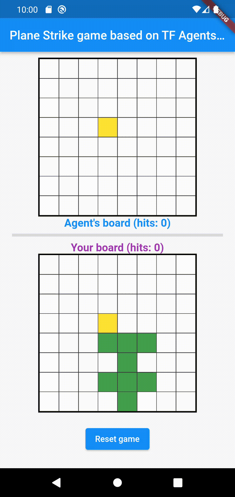

# Board game app built with TensorFlow Agents and Flutter

This folder contains the code for [TensorFlow Agents](https://www.tensorflow.org/agents) + Flutter codelab. It is broken down into 6 steps:

1. Create a TensorFlow Agents Python environment
2. Train the game agent with TensorFlow Agents
3. Deploy the trained model with TensorFlow Serving
4. Create the Flutter app for Android and iOS
5. Run the Flutter app on the desktop platforms
6. Run the Flutter app on the web platform

